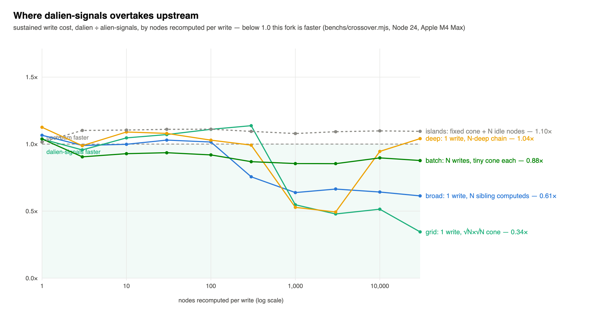
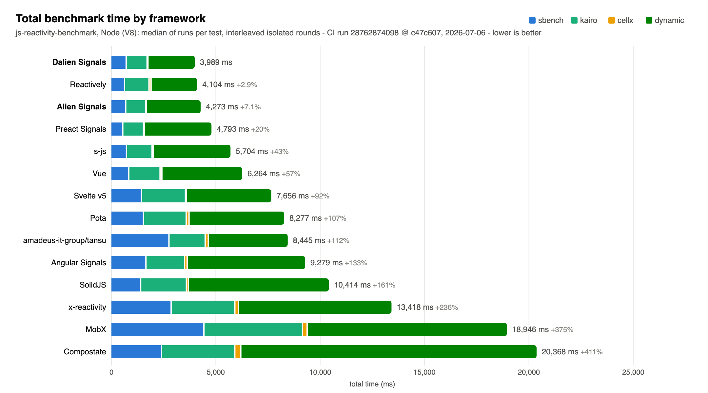
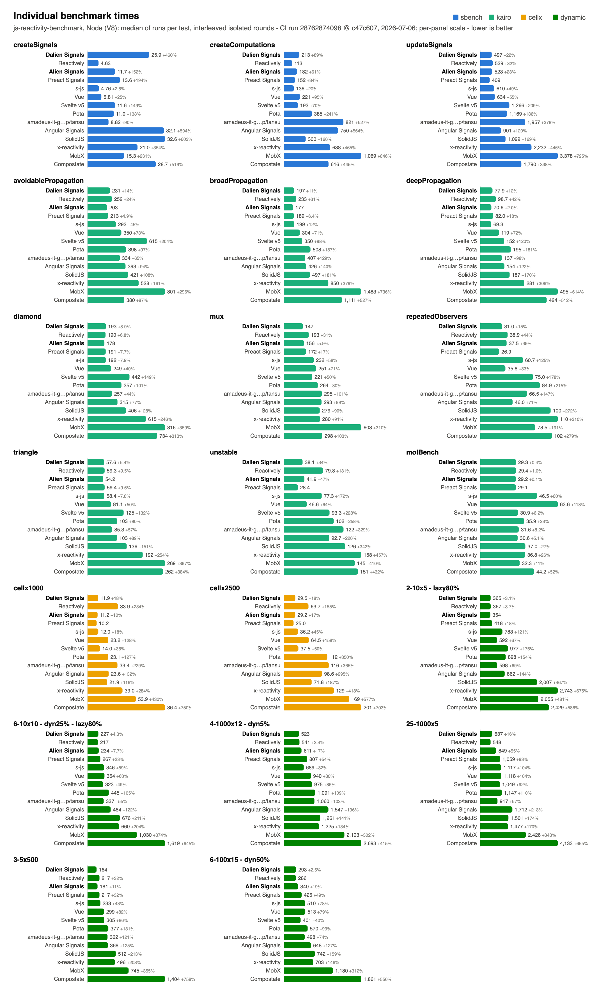
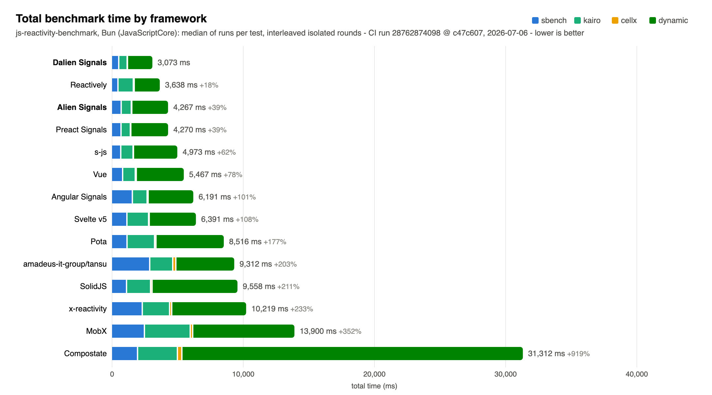
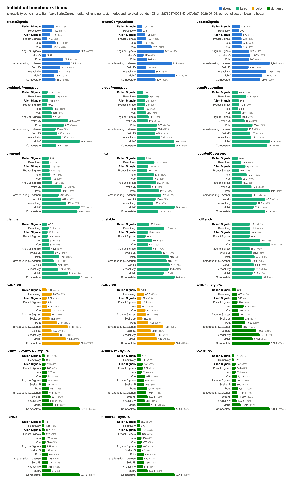
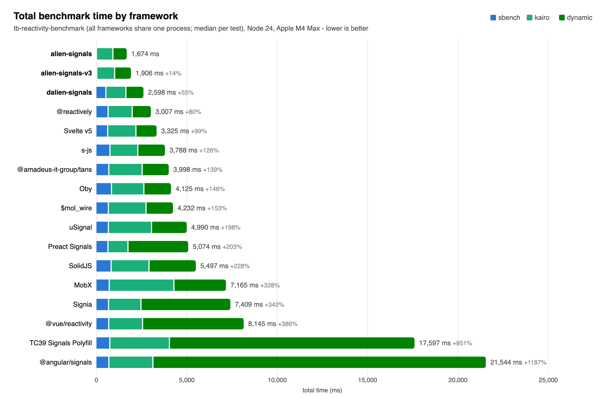
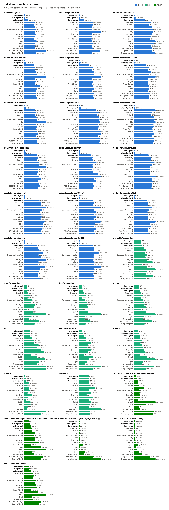

<p align="center">
	<br>
<p>

<p align="center">
	<a href="https://npmjs.com/package/dalien-signals"></a>
	<a href="https://deepwiki.com/justjake/dalien-signals"></a>
</p>

# dalien-signals

dalien-signals is a fork of [alien-signals](https://github.com/stackblitz/alien-signals) with a data-oriented core: the dependency graph lives in one `Int32Array` — nodes and edges are 32-byte integer records, values and callbacks sit in side arrays — traversal uses preallocated stacks, and graph maintenance allocates no GC objects. The algorithm and the package-root API are upstream's; all 179 conformance cases pass.

What changes in practice:

- **Throughput over micro-latency, mixed workloads over single hot loops.** In a dedicated loop over one small graph — the regime microbenchmarks love and the JIT optimizes hardest — upstream leads: sustained small-update writes run 1.15–1.45× upstream's time, and the nine-shape write matrix (`benchs/propagateSustained.mjs`, run against upstream) averages ~9% behind. The picture inverts as work grows or mixes: a single update that recomputes thousands of nodes runs 1.4–2× faster on broad and grid-shaped waves (the crossover chart below maps where — and where not, like very deep chains), and in the canonical benchmark below — mixed workloads, closer to applications — this fork finishes first overall on both runtimes. Part of the hot-loop cost is deliberate: the engine pre-seeds its callback call sites past the JIT's speculation threshold (`benchs/phaseTransition.mjs`), trading a little single-shape speed for performance that stays flat as an application's callback shapes diversify. For scale: in the suite's closest test to a typical interactive app (a small layered graph, one atom written per update), the difference is ~20 nanoseconds per update — imperceptible for any library in the top half of the chart. At that scale the differentiators are the tails: burst updates (document loads, sync patches, undo), heap size and GC churn over a long session, and behavior that does not degrade as the app grows.
- **Reads of clean computeds skip re-verification.** A global write epoch stamps every verified computed; while nothing has been written, re-reading costs one compare against the node's own record instead of a dependency re-check. A single clean read is about a nanosecond slower than upstream's flag check, but when many derived reads follow each write — the shape of the dynamic suite below — the stamps carry the win.
- **Leak-free by construction.** Dropped signal/computed handles reclaim their records through a required `FinalizationRegistry` (ES2021), and getters are owned by their handles — the engine borrows them only while the computed is subscribed, so no internal table can pin user closures. 10,000 live effects retain ~47% less heap than upstream; signals pay about one registry cell each, and computeds join the registry only once first evaluated, so computeds that are created but never read cost nothing.
- **Fixed-capacity store, allocated on first use.** `configure({ initialRecords })` sizes it before first use (default 2^23 records ≈ 256 MB of lazily-mapped virtual pages; physical memory tracks records actually touched). The plane never grows or moves — that is what lets handles reach the graph with zero indirection.
- **Generation lifecycle.** `system.reset()` tears down an entire generation in one sweep: it rewinds the record plane and replaces the finalization registry, so a dead generation costs the garbage collector a few large objects instead of one weak cell per handle. Request-scoped graphs, worker pools, and benchmark harnesses want exactly this; every handle minted before a reset is invalid afterwards.
- **`dalien-signals/system` is a new, incompatible interface** (a self-contained engine over integer handles). The package root is drop-in, except `getActiveSub()` returns a flags view object and handle functions are anonymous (`isSignal` and friends still work).

**How the engine adapts to application size.** JavaScript engines watch every place a function gets called: a call site that only ever calls one function gets aggressively specialized — great, until the day a different function shows up there and the engine throws the specialized code away and rebuilds it while your app runs slower. A signals library funnels *your* getters and effect callbacks through a few such internal call sites, so a growing app — new components, new derived values — triggers exactly that teardown, repeatedly. dalien-signals defuses this with a one-time warmup: when the graph reaches 33 nodes (any real app crosses that while building its first screen), the engine briefly exercises its call paths with a variety of function shapes, telling the JavaScript engine up front not to specialize there. From then on performance stays flat no matter how many kinds of callbacks the app adds. Programs that stay tiny — a hot loop over a handful of signals — never trigger the warmup and keep the engine's full specialization. The threshold is not a magic number: warming up earlier measurably taxes small programs for no benefit, warming up later measurably exposes growing apps to the stutter, and every value between roughly 20 and 45 measures identically — `benchs/seedThreshold.mjs` reproduces both boundaries, and `benchs/phaseTransition.mjs` verifies the flatness after engine upgrades.

The crossover between this fork and upstream is governed by one variable: **how many nodes a single write recomputes**. It is not the number of atoms written per batch (thirty thousand tiny writes per flush never cross — each write's small wave pays upstream's favorite price every time), and not graph size (a fixed cone surrounded by thirty thousand idle nodes holds a constant ratio). The crossover now sits at about **two recomputed nodes**: lazy call-site seeding keeps tiny dedicated processes on the JIT's fast path, and shallow fast paths resolve one- and two-hop dirty walks without the general machinery, putting the smallest cones inside measurement noise of upstream (ratios 0.9–1.1 across shape families at one to three nodes) and deepening past 2× faster at the largest measured cones (thirty-thousand-node grid waves). The one shape that keeps a real upstream lead is the deep chain — two to a few hundred nodes strung in a line, where each level is a pointer chase for both libraries and upstream's fused pipeline stays ~15–35% cheaper until the chain passes a thousand nodes. Pure depth is the weakest axis — a single chain is pointer-chasing for both sides, and upstream's objects are allocated in chain order too.



Below is the [js-reactivity-benchmark](https://github.com/milomg/js-reactivity-benchmark) suite (sbench, kairo, cellx, dynamic). The numbers are from CI and anyone can reproduce them: the [benchmark workflow](https://github.com/justjake/alien-signals/actions/workflows/benchmark.yml) runs a pinned harness against this repo — dispatch it with `frameworks: ALL` for the full chart (these charts: run [28762874098](https://github.com/justjake/alien-signals/actions/runs/28762874098) at c47c607). Methodology: each framework runs in its own process; each test reports the median of its runs (not the fastest, which hides amortized costs); frameworks run interleaved round-robin, four complete rounds each on its own runner, with per-test medians across rounds (`benchs/ci/` documents why that keeps ratios honest). The dalien adapter uses `reset()` between tests — the arena equivalent of the wholesale collection a dead GC-managed graph gets automatically.

**Node (V8)** — dalien-signals finishes first overall; upstream takes 7% longer:

<!-- benchmark:node:begin — generated by benchs/ci/pull-run.mjs; edits inside are overwritten -->


<details>
<summary>Node (V8) suite totals (ms, lower is better) — CI run 28762874098 @ c47c607, 2026-07-06</summary>

| framework | sbench | kairo | cellx | dynamic | total |
| --- | ---: | ---: | ---: | ---: | ---: |
| Dalien Signals | 736 | 1002 | 41 | 2209 | 3989 |
| Reactively | 657 | 1174 | 98 | 2175 | 4104 |
| Alien Signals | 716 | 946 | 40 | 2569 | 4273 |
| Preact Signals | 574 | 990 | 35 | 3193 | 4793 |
| s-js | 750 | 1228 | 48 | 3678 | 5704 |
| Vue | 861 | 1499 | 88 | 3816 | 6264 |
| Svelte v5 | 1470 | 2105 | 52 | 4029 | 7656 |
| Pota | 1565 | 2048 | 135 | 4529 | 8277 |
| amadeus-it-group/tansu | 2787 | 1735 | 150 | 3774 | 8445 |
| Angular Signals | 1683 | 1853 | 122 | 5621 | 9279 |
| SolidJS | 1432 | 2189 | 94 | 6700 | 10414 |
| x-reactivity | 2892 | 3052 | 168 | 7306 | 13418 |
| MobX | 4462 | 4721 | 223 | 9539 | 18946 |
| Compostate | 2435 | 3507 | 287 | 14139 | 20368 |



</details>
<!-- benchmark:node:end -->

**Bun (JavaScriptCore)** — first overall again; upstream takes 39% longer:

<!-- benchmark:bun:begin — generated by benchs/ci/pull-run.mjs; edits inside are overwritten -->


<details>
<summary>Bun (JavaScriptCore) suite totals (ms, lower is better) — CI run 28762874098 @ c47c607, 2026-07-06</summary>

| framework | sbench | kairo | cellx | dynamic | total |
| --- | ---: | ---: | ---: | ---: | ---: |
| Dalien Signals | 559 | 638 | 28 | 1847 | 3073 |
| Reactively | 498 | 1171 | 69 | 1900 | 3638 |
| Alien Signals | 744 | 770 | 39 | 2713 | 4267 |
| Preact Signals | 733 | 710 | 37 | 2791 | 4270 |
| s-js | 712 | 937 | 34 | 3290 | 4973 |
| Vue | 856 | 963 | 76 | 3573 | 5467 |
| Angular Signals | 1596 | 1126 | 76 | 3393 | 6191 |
| Svelte v5 | 1182 | 1650 | 52 | 3508 | 6391 |
| Pota | 1190 | 2098 | 108 | 5120 | 8516 |
| amadeus-it-group/tansu | 2920 | 1753 | 237 | 4402 | 9312 |
| SolidJS | 1152 | 1832 | 114 | 6460 | 9558 |
| x-reactivity | 2352 | 2082 | 163 | 5622 | 10219 |
| MobX | 2515 | 3493 | 188 | 7704 | 13900 |
| Compostate | 1992 | 3037 | 341 | 25942 | 31312 |



</details>
<!-- benchmark:bun:end -->

The [transitive-bullshit fork](https://github.com/transitive-bullshit/js-reactivity-benchmark) of the same suite runs every framework in one shared Node process — the methodology behind the upstream alien-signals chart further down. `alien-signals` here is the 1.0.0-alpha.1 that repo pins; `alien-signals-v3` is the v3.2.1 this fork tracks. Read it with two caveats: shared-process totals are order-sensitive (each framework inherits the JIT and heap state of whatever ran before it — in our testing, reordering frameworks changed relative results materially), and its creation tests end their timed region with a forced full GC over ~100k just-abandoned nodes, which bills dalien-signals' `FinalizationRegistry` cells inside the timing while upstream's dead nodes are ordinary garbage. That one suite accounts for most of the gap to upstream below. Node 24, Apple M4 Max, 2026-07-06; raw data in `benchs/results/`.

<!-- benchmark:tb:begin — generated by benchs/ci/pull-run.mjs; edits inside are overwritten -->


<details>
<summary>Suite totals (ms, lower is better)</summary>

| framework | sbench | kairo | dynamic | total |
| --- | ---: | ---: | ---: | ---: |
| alien-signals 1.0.0-alpha.1 | 32 | 907 | 735 | 1674 |
| alien-signals v3.2.1 | 50 | 985 | 871 | 1906 |
| dalien-signals | 551 | 1106 | 941 | 2598 |
| @reactively | 673 | 1336 | 999 | 3007 |
| Svelte v5 | 651 | 1561 | 1113 | 3325 |
| s-js | 778 | 1539 | 1471 | 3788 |
| @amadeus-it-group/tansu | 713 | 1845 | 1440 | 3998 |
| Oby | 863 | 1789 | 1472 | 4125 |
| $mol_wire | 688 | 2085 | 1459 | 4232 |
| uSignal | 688 | 2390 | 1912 | 4990 |
| Preact Signals | 665 | 1108 | 3301 | 5074 |
| SolidJS | 840 | 2097 | 2559 | 5497 |
| MobX | 737 | 3578 | 2850 | 7165 |
| Signia | 699 | 1792 | 4917 | 7409 |
| @vue/reactivity | 709 | 1873 | 5563 | 8145 |
| TC39 Signals Polyfill | 771 | 3296 | 13530 | 17597 |
| @angular/signals | 715 | 2437 | 18392 | 21544 |



</details>
<!-- benchmark:tb:end -->

---

`alien-signals` explores a push-pull based signal algorithm. The implementation is related to the following frontend projects:

- Propagation algorithm of Vue 3
- Preact’s double-linked-list approach (https://preactjs.com/blog/signal-boosting/)
- Inner effects scheduling of Svelte
- Graph-coloring approach of Reactively (https://milomg.dev/2022-12-01/reactivity)

We impose some constraints (such as not using Array/Set/Map and disallowing function recursion in [the algorithmic core](https://github.com/stackblitz/alien-signals/blob/master/src/system.ts)) to ensure performance. We found that under these conditions, maintaining algorithmic simplicity offers more significant improvements than complex scheduling strategies.

I wrote the reactivity code for both Vue and alien-signals. Below is a benchmark comparison against Vue 3.4 and other frameworks. The core algorithm has since been [ported back to Vue 3.6](https://github.com/vuejs/core/pull/12349).


> Benchmark repo: https://github.com/transitive-bullshit/js-reactivity-benchmark

## Background

I spent considerable time [optimizing Vue 3.4’s reactivity system](https://github.com/vuejs/core/pull/5912), gaining experience along the way. Since Vue 3.5 [switched to a pull-based algorithm similar to Preact](https://github.com/vuejs/core/pull/10397), I decided to continue researching a push-pull based implementation in a separate project. The algorithm is used in Vue language tools for incremental AST parsing and virtual code generation.

## Other Language Implementations

- **Dart:** [medz/alien-signals-dart](https://github.com/medz/alien-signals-dart)
- **Dart:** [void-signals/void_signals](https://github.com/void-signals/void_signals)
- **Lua:** [YanqingXu/alien-signals-in-lua](https://github.com/YanqingXu/alien-signals-in-lua)
- **Lua 5.4:** [xuhuanzy/alien-signals-lua](https://github.com/xuhuanzy/alien-signals-lua)
- **Luau:** [Nicell/alien-signals-luau](https://github.com/Nicell/alien-signals-luau)
- **Java:** [CTRL-Neo-Studios/java-alien-signals](https://github.com/CTRL-Neo-Studios/java-alien-signals)
- **C#:** [CTRL-Neo-Studios/csharp-alien-signals](https://github.com/CTRL-Neo-Studios/csharp-alien-signals)
- **Go:** [delaneyj/alien-signals-go](https://github.com/delaneyj/alien-signals-go)
- **Rust:** [wuzekang/samara-signals](https://github.com/wuzekang/samara/tree/main/crates/signals)
- **Rust:** [ohkami-rs/alien-signals-rs](https://github.com/ohkami-rs/alien-signals-rs)

## Derived Projects

- [Rajaniraiyn/react-alien-signals](https://github.com/Rajaniraiyn/react-alien-signals): React bindings for the alien-signals API
- [CCherry07/alien-deepsignals](https://github.com/CCherry07/alien-deepsignals): Use alien-signals with the interface of a plain JavaScript object
- [hunghg255/reactjs-signal](https://github.com/hunghg255/reactjs-signal): Share Store State with Signal Pattern
- [gn8-ai/universe-alien-signals](https://github.com/gn8-ai/universe-alien-signals): Enables simple use of the Alien Signals state management system in modern frontend frameworks
- [WebReflection/alien-signals](https://github.com/WebReflection/alien-signals): Preact signals like API and a class based approach for easy brand check
- [@lift-html/alien](https://github.com/JLarky/lift-html/tree/main/packages/alien): Integrating alien-signals into lift-html
- [ilha](https://github.com/ilhajs/ilha): A tiny web UI library built around the islands architecture
- [@sigrea/core](https://github.com/sigrea/core): Signals, deep reactivity, and molecule lifecycles built on alien-signals
- [@lazy-promise/alien-signals](https://github.com/lazy-promise/lazy-promise/tree/main/packages/alien-signals): Async signals built on top of alien-signals and LazyPromise

## Adoption

- [vuejs/core](https://github.com/vuejs/core): The core algorithm has been ported to v3.6 (PR: https://github.com/vuejs/core/pull/12349)
- [statelyai/xstate](https://github.com/statelyai/xstate): The core algorithm has been ported to implement the atom architecture (PR: https://github.com/statelyai/xstate/pull/5250)
- [flamrdevs/xignal](https://github.com/flamrdevs/xignal): Infrastructure for the reactive system
- [vuejs/language-tools](https://github.com/vuejs/language-tools): Used in the language-core package for virtual code generation
- [unuse](https://github.com/un-ts/unuse): A framework-agnostic `use` library inspired by `VueUse`

## Usage

#### Basic APIs

```ts
import { signal, computed, effect } from "alien-signals";

const count = signal(1);
const doubleCount = computed(() => count() * 2);

effect(() => {
  console.log(`Count is: ${count()}`);
}); // Console: Count is: 1

console.log(doubleCount()); // 2

count(2); // Console: Count is: 2

console.log(doubleCount()); // 4
```

#### Effect Scope

```ts
import { signal, effect, effectScope } from "alien-signals";

const count = signal(1);

const stopScope = effectScope(() => {
  effect(() => {
    console.log(`Count in scope: ${count()}`);
  }); // Console: Count in scope: 1
});

count(2); // Console: Count in scope: 2

stopScope();

count(3); // No console output
```

#### Nested Effects

Effects can be nested inside other effects. When the outer effect re-runs, inner effects from the previous run are automatically cleaned up, and new inner effects are created if needed. The system ensures proper execution order — outer effects always run before their inner effects:

```ts
import { signal, effect } from "alien-signals";

const show = signal(true);
const count = signal(1);

effect(() => {
  if (show()) {
    // This inner effect is created when show() is true
    effect(() => {
      console.log(`Count is: ${count()}`);
    });
  }
}); // Console: Count is: 1

count(2); // Console: Count is: 2

// When show becomes false, the inner effect is cleaned up
show(false); // No output

count(3); // No output (inner effect no longer exists)
```

#### Manual Triggering

The `trigger()` function allows you to manually trigger updates for downstream dependencies when you've directly mutated a signal's value without using the signal setter:

```ts
import { signal, computed, trigger } from "alien-signals";

const arr = signal<number[]>([]);
const length = computed(() => arr().length);

console.log(length()); // 0

// Direct mutation doesn't automatically trigger updates
arr().push(1);
console.log(length()); // Still 0

// Manually trigger updates
trigger(arr);
console.log(length()); // 1
```

You can also trigger multiple signals at once:

```ts
import { signal, computed, trigger } from "alien-signals";

const src1 = signal<number[]>([]);
const src2 = signal<number[]>([]);
const total = computed(() => src1().length + src2().length);

src1().push(1);
src2().push(2);

trigger(() => {
  src1();
  src2();
});

console.log(total()); // 2
```

#### Creating Your Own Surface API

You can reuse alien-signals’ core algorithm via `createReactiveSystem()` to build your own signal API. For implementation examples, see:

- [Starter template](https://github.com/johnsoncodehk/alien-signals-starter) (implements `.get()` & `.set()` methods like the [Signals proposal](https://github.com/tc39/proposal-signals))
- [stackblitz/alien-signals/src/index.ts](https://github.com/stackblitz/alien-signals/blob/master/src/index.ts)
- [proposal-signals/signal-polyfill#44](https://github.com/proposal-signals/signal-polyfill/pull/44)

## About `propagate` and `checkDirty` functions

The actual implementations of `propagate` and `checkDirty` in [system.ts](https://github.com/stackblitz/alien-signals/blob/master/src/system.ts) replace recursive calls with iterative stack-based traversal for performance. The recursive versions below are equivalent and easier to follow — useful as a reference when porting to other languages where the iterative optimization may not help.

<details>
<summary><code>propagate</code></summary>

```ts
function propagate(link: Link, innerWrite: boolean): void {
  do {
    const sub = link.sub;

    let flags = sub.flags;

    if (
      !(
        flags &
        (ReactiveFlags.RecursedCheck |
          ReactiveFlags.Recursed |
          ReactiveFlags.Dirty |
          ReactiveFlags.Pending)
      )
    ) {
      sub.flags = flags | ReactiveFlags.Pending;
      if (innerWrite) {
        sub.flags |= ReactiveFlags.Recursed;
      }
    } else if (
      !(flags & (ReactiveFlags.RecursedCheck | ReactiveFlags.Recursed))
    ) {
      flags = ReactiveFlags.None;
    } else if (!(flags & ReactiveFlags.RecursedCheck)) {
      sub.flags = (flags & ~ReactiveFlags.Recursed) | ReactiveFlags.Pending;
    } else if (
      !(flags & (ReactiveFlags.Dirty | ReactiveFlags.Pending)) &&
      isValidLink(link, sub)
    ) {
      sub.flags = flags | ReactiveFlags.Recursed | ReactiveFlags.Pending;
      flags &= ReactiveFlags.Mutable;
    } else {
      flags = ReactiveFlags.None;
    }

    if (flags & ReactiveFlags.Watching) {
      notify(sub);
    }

    if (flags & ReactiveFlags.Mutable) {
      const subSubs = sub.subs;
      if (subSubs !== undefined) {
        propagate(subSubs, innerWrite);
      }
    }

    link = link.nextSub!;
  } while (link !== undefined);
}
```

</details>

<details>
<summary><code>checkDirty</code></summary>

```ts
function checkDirty(link: Link, sub: ReactiveNode): boolean {
  do {
    const dep = link.dep;
    const depFlags = dep.flags;

    if (sub.flags & ReactiveFlags.Dirty) {
      return true;
    } else if (
      (depFlags & (ReactiveFlags.Mutable | ReactiveFlags.Dirty)) ===
      (ReactiveFlags.Mutable | ReactiveFlags.Dirty)
    ) {
      if (update(dep)) {
        const subs = dep.subs!;
        if (subs.nextSub !== undefined) {
          shallowPropagate(subs);
        }
        return true;
      }
    } else if (
      (depFlags & (ReactiveFlags.Mutable | ReactiveFlags.Pending)) ===
      (ReactiveFlags.Mutable | ReactiveFlags.Pending)
    ) {
      if (checkDirty(dep.deps!, dep)) {
        if (update(dep)) {
          const subs = dep.subs!;
          if (subs.nextSub !== undefined) {
            shallowPropagate(subs);
          }
          return true;
        }
      } else {
        dep.flags = depFlags & ~ReactiveFlags.Pending;
      }
    }

    link = link.nextDep!;
  } while (link !== undefined);

  return false;
}
```

</details>
