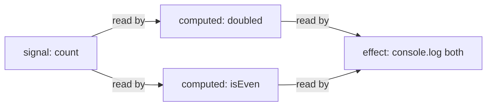
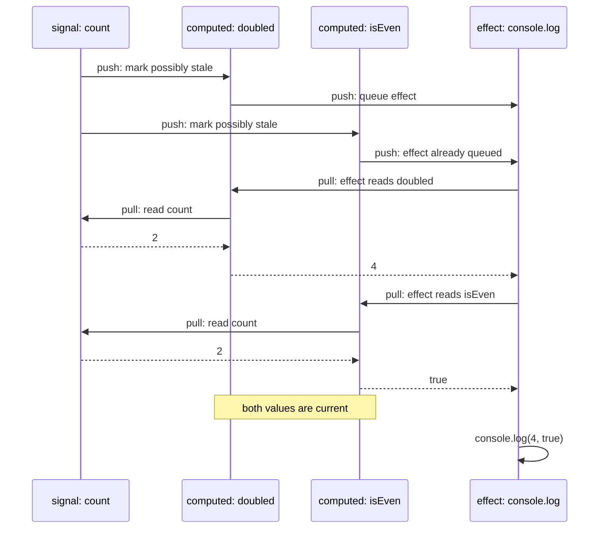
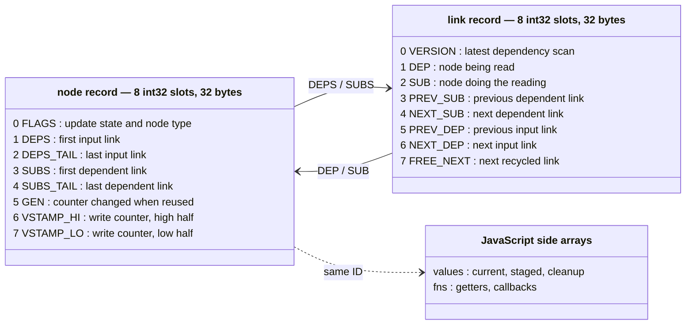
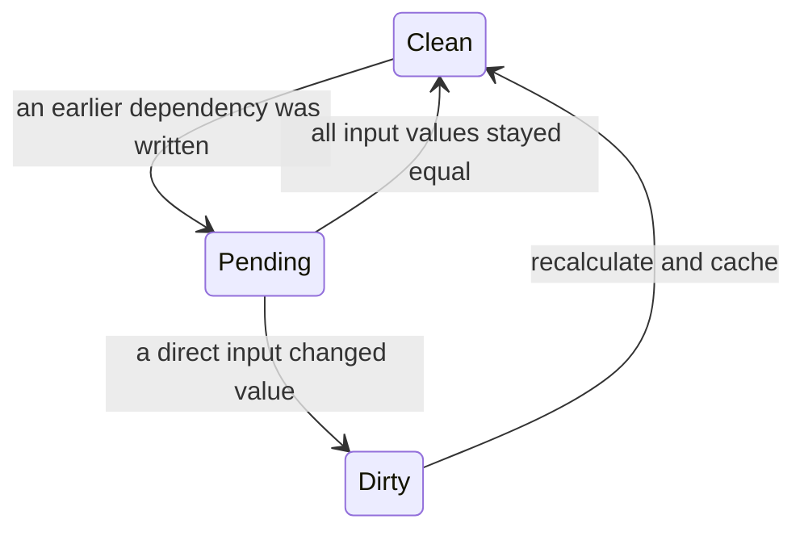

<p align="center">
	<br>
</p>

<p align="center">
	<a href="https://npmjs.com/package/dalien-signals"></a>
	<a href="https://deepwiki.com/justjake/dalien-signals"></a>
</p>

# dalien-signals

**d**alien-signals is a **d**ata-oriented fork of [alien-signals][], a fast [signals][tc39] reactivity library. Its reactive dependency graph is stored in a single `Int32Array` memory [arena][arena-wikipedia], like a contiguous array of structs in C.

The default arena's backing `ArrayBuffer` is 256 MB. Large zero-filled buffers are typically demand-paged, or lazily committed: allocation reserves virtual address space, but resident physical memory grows only as pages are touched, so this doesn't immediately use all 256 MB (exact behavior depends on the JS runtime engine and operating system).

## How it works

`dalien-signals` keeps calculations and callbacks in sync with changing values. It provides three main primitives:

- A `signal` stores a value. Call it with no argument to read it, or with an argument to write it.
- A `computed` derives and caches a value from signals or other computeds.
- An `effect` runs a function now, then again when a value it read changes.

Dependencies are automatic. While a computed or effect runs, the library records every signal and computed it reads.

```ts
import { computed, effect, signal } from "dalien-signals";

const count = signal(1);
const doubled = computed(() => count() * 2);
const isEven = computed(() => count() % 2 === 0);

effect(() => console.log(doubled(), isEven())); // 2 false
count(2); // 4 true
```



Arrows point from a value to the work that depends on it. When `count` changes, the effect is reached through both computeds but queued only once.

Recalculating every downstream node on each write would waste work. Recalculating dependents immediately could also run an effect more than once or before all of its inputs are current. Updates instead use a push-pull algorithm:

1. **Push:** a write marks downstream computeds and effects as possibly stale. Effects are queued, but no user callback runs during this graph walk.
2. **Pull:** before a computed returns its value, it checks its dependencies and recalculates if necessary. A queued effect reruns and pulls each computed it reads up to date. If a computed's value has not changed, the update stops along that path.



## API

````ts
import type { ReactiveNode } from "dalien-signals/system";

/** Return the node currently recording signal reads, if there is one. */
export declare function getActiveSub(): ReactiveNode | undefined;

/**
 * Set the node that records subsequent reads.
 * Returns the previous node so it can be restored.
 */
export declare function setActiveSub(
  sub?: ReactiveNode,
): ReactiveNode | undefined;

/**
 * Set the arena's starting capacity before creating any reactive values.
 * `initialRecords` defaults to 8,388,608 32-byte records.
 *
 * @example
 * ```ts
 * configure({ initialRecords: 1 << 20 });
 * const count = signal(0);
 * ```
 */
export declare function configure(options?: { initialRecords?: number }): void;

/** Return the number of currently open batches. */
export declare function getBatchDepth(): number;

/**
 * Open a batch. Queued effects wait for the matching `endBatch()`.
 *
 * @example
 * ```ts
 * const count = signal(0);
 * effect(() => console.log(count())); // 0
 * startBatch();
 * try {
 *   count(1);
 *   count(2);
 * } finally {
 *   endBatch(); // 2; the effect runs once.
 * }
 * ```
 */
export declare function startBatch(): void;

/** Close a batch, flushing effects when the outermost batch closes. */
export declare function endBatch(): void;

/** Return whether `fn` is a signal created by this package. */
export declare function isSignal(fn: () => void): boolean;

/** Return whether `fn` is a computed created by this package. */
export declare function isComputed(fn: () => void): boolean;

/** Return whether `fn` is an effect disposer created by this package. */
export declare function isEffect(fn: () => void): boolean;

/** Return whether `fn` is an effect-scope disposer created by this package. */
export declare function isEffectScope(fn: () => void): boolean;

/**
 * Create a reactive value. Call the returned function with no argument to
 * read the value, or with an argument to write it.
 *
 * @example
 * ```ts
 * const count = signal(0);
 * count();  // 0
 * count(1);
 * count();  // 1
 * ```
 */
export declare function signal<T>(): {
  (): T | undefined;
  (value: T | undefined): void;
};
export declare function signal<T>(initialValue: T): {
  (): T;
  (value: T): void;
};

/**
 * Create a cached value derived from the signals and computeds read by
 * `getter`. Its argument is the previous value, or `undefined` initially.
 *
 * @example
 * ```ts
 * const count = signal(2);
 * const doubled = computed(() => count() * 2);
 * doubled(); // 4
 * count(3);
 * doubled(); // 6
 * ```
 */
export declare function computed<T>(getter: (previousValue?: T) => T): () => T;

/**
 * Run `fn` immediately, then rerun it when a value it read changes.
 * `fn` may return cleanup work. The returned function stops the effect.
 *
 * @example
 * ```ts
 * const count = signal(0);
 * const stop = effect(() => console.log(count())); // 0
 * count(1); // 1
 * stop();
 * ```
 */
export declare function effect(fn: () => void | (() => void)): () => void;

/**
 * Run `fn` and group every nested effect it creates.
 * The returned function stops the group and runs its cleanup work.
 *
 * @example
 * ```ts
 * const count = signal(0);
 * const stop = effectScope(() => {
 *   effect(() => console.log(count()));
 * });
 * stop();
 * count(1); // No log; the scope is stopped.
 * ```
 */
export declare function effectScope(fn: () => void): () => void;

/**
 * Notify dependents after mutating values stored inside signals in place.
 * Read each changed signal inside `fn`.
 *
 * @example
 * ```ts
 * const items = signal<string[]>([]);
 * const size = computed(() => items().length);
 * size(); // 0
 * items().push('one');
 * trigger(items);
 * size(); // 1
 * ```
 */
export declare function trigger(fn: () => void): void;
````

The `dalien-signals/system` entry point exposes isolated engines, numeric record IDs, debugging, and bulk reset.

## Storage

Internally, each signal, computed, effect, or scope is a node. Each dependency is a link. Both use eight-slot, 32-byte records in one fixed-capacity `Int32Array`, JavaScript's typed array of 32-bit integers:



- This array is the **arena**. An ID is a record's starting offset within it; ID `0` means “no record.”
- A free list chains unused records together so they can be recycled without allocating new edge objects.
- Side arrays hold values, cleanup functions, getters, and callbacks.

`FLAGS` stores the node type and update state. A computed moves through three states:



- **Clean:** the cached value is current. This state has no `ReactiveFlags.Dirty` or `ReactiveFlags.Pending` bit.
- **Pending:** an input may have changed, so the node must check its inputs before deciding whether to recalculate.
- **Dirty:** a direct input changed, so the node must recalculate before returning its value.

Effects use the same pending-versus-dirty distinction to decide whether their callbacks need to rerun. The live `.flags` object returned by `getActiveSub()` exposes these bits:

| bit | name                          | meaning                                                                           |
| --: | ----------------------------- | --------------------------------------------------------------------------------- |
|   0 | `ReactiveFlags.Mutable`       | Changes can continue through this node to its dependents.                         |
|   1 | `ReactiveFlags.Watching`      | This node is an effect that should be queued when reached.                        |
|   2 | `ReactiveFlags.RecursedCheck` | The engine is watching for a write that loops back into the callback now running. |
|   3 | `ReactiveFlags.Recursed`      | Such a recursive write reached this node.                                         |
|   4 | `ReactiveFlags.Dirty`         | This node is known to need an update.                                             |
|   5 | `ReactiveFlags.Pending`       | An earlier dependency may require this node to update.                            |
|   6 | `HAS_CHILD_EFFECT` (internal) | This node owns nested effects that require ordered cleanup.                       |

Bits identifying the node type or tracking record recycling are engine-only and are hidden from that object. `ReactiveFlags`, exported by `dalien-signals/system`, names bits 0–5 so integrations do not need to hard-code their numeric values.

Whenever a write could invalidate cached work, the engine increments a global write counter, called the **epoch**. After checking or recalculating a computed, it saves the epoch into the record's stamp — one float64 spanning slots 6–7, read through a `Float64Array` view over the same arena (a 53-bit counter never wraps, and one load-and-compare replaces two). If the saved and current epochs match on the next read, no write that could affect the cache occurred in between, so the value can be returned without walking the graph. If a callback writes another signal during the check, the current epoch advances and the saved value no longer matches.

## Performance details

- One- and two-link updates use dedicated fast paths instead of the general graph traversal. Runs of single-dependency, single-subscriber nodes — chains — walk without the traversal stack: the way back up is recoverable from each node's unique subscriber link.
- The engine seeds its user-callback call sites past V8's megamorphic threshold (>4 function shapes) when minted callback shapes diversify — sampled per call-site family (getters vs effect callbacks) on a geometric cadence. Single-shape processes never seed and keep full monomorphic JIT speculation at any graph size (measured 1.15x on a hot chain); diverse processes converge to the seeded steady state (insurance ratio 1.01, `benchs/phaseTransition.mjs`). `configure({ seeding: 'eager' | 'off' })` overrides.
- A `FinalizationRegistry` tracks when signal or computed functions are GC'd and returns their underlying record memory to a free-list for re-use.
- The lower-level engine's `reset()` method clears the whole arena at once. Functions and numeric IDs created before the reset become invalid.
- `tests/bytecode.spec.ts` enforces V8's 460-bytecode inline limit for hot functions. Large functions are split so the JIT can inline them into callers.

## Build your own framework

`createReactiveSystem` returns a complete, composable kit of id-based operations. `src/index.ts` is one example client — a typed signal framework built strictly from this public surface (`tests/policyBoundary.spec.ts` enforces that). A host can build its own instead:

````ts
import { createReactiveSystem } from "dalien-signals/system";
import type {
  ComputedId,
  EffectId,
  EffectScopeId,
  LinkId,
  NodeId,
  SignalId,
} from "dalien-signals/system";

export declare function createReactiveSystem(options?: {
  /** Arena starting capacity in 32-byte records. Default 8,388,608. */
  initialRecords?: number;
  /**
   * Take over effect scheduling. The engine reports each affected effect
   * once per wave and runs nothing until you call `runEffect(id, gen)`.
   *
   * @example Buffer all effects to the end of the animation frame:
   * ```ts
   * const queue: Array<[number, number]> = [];
   * const sys = createReactiveSystem({
   *   notify: (id, gen) => {
   *     if (queue.push([id, gen]) === 1) {
   *       requestAnimationFrame(() => {
   *         for (const [e, g] of queue.splice(0)) sys.runEffect(e, g);
   *       });
   *     }
   *   },
   * });
   * ```
   */
  notify?: (effectId: number, gen: number) => void;
  /**
   * Runs when a node gains its first subscriber. Whatever it returns is
   * stored and passed to `stop`. Connect external resources here.
   * `js` is a signal's current value, or the node's installed function.
   */
  start?: (id: NodeId, js: unknown) => unknown;
  /**
   * Runs when the node's last subscriber unlinks, and for every started
   * node during `reset()`. Disconnect the resource `start` connected.
   */
  stop?: (id: NodeId, js: unknown, state: unknown) => void;
}): ReactiveSystem;

export declare interface ReactiveSystem {
  /** Allocate a node record. IDs are integers into this system's arena. */
  signal(initialValue?: unknown): SignalId;
  computed(getter: (previousValue?: unknown) => unknown): ComputedId;
  effect(fn: () => (() => void) | void): EffectId;
  effectScope(fn: () => void): EffectScopeId;

  /** Read or stage a value; pull a computed up to date. */
  signalRead(id: SignalId): unknown;
  signalWrite(id: SignalId, value: unknown): void;
  computedRead(id: ComputedId): unknown;

  /** Generation counter for an id — capture at creation, pass to the
   * gen-guarded operations so stale ids become no-ops. */
  gen(id: NodeId): number;
  dispose(id: EffectId | EffectScopeId, gen: number): void;
  runEffect(id: EffectId, gen: number): void;

  /**
   * Add a dependency edge by hand: `sub` re-verifies when `dep` changes.
   * Returns the edge id (the existing one if already linked). Manual edges
   * age out if the subscriber re-tracks without re-establishing them,
   * exactly like read-discovered edges.
   */
  link(depId: NodeId, subId: NodeId): LinkId;
  unlink(linkId: LinkId): void;

  /**
   * Out-of-band invalidation: mark everything downstream of `id` possibly
   * stale, queue affected effects, invalidate epoch stamps, and flush
   * unless a batch is open. Follow with `shallowPropagate(id)` to promote
   * direct subscribers to dirty so they actually recompute.
   */
  propagate(id: NodeId): void;
  shallowPropagate(id: NodeId): void;

  /** Tracking control and introspection. */
  setActiveSub(id: NodeId): NodeId;
  getActiveSub(): NodeId;
  nodeFlags(id: NodeId): number;
  setNodeFlags(id: NodeId, flags: number): void;
  stats(): object;
  buffer(): Int32Array;
}
````

Using an ID after its node is disposed or reclaimed is undefined behavior, except through the gen-guarded operations (`dispose`, `runEffect`).

## Constraints

- The arena grows between operations. Once 3/4 full, the engine is rebuilt over an arena twice the size; every record is copied and IDs survive, so functions created before a growth keep working. Before any growth there is no cost (totals within noise; epoch-fast-path reads pay nothing). Growth rebuilds the engine from freshly compiled source (`new Function`) so each generation keeps V8's arena-address embedding; measured post-growth cost is ~1.1-1.2x (functions created before the growth pay one forwarding hop). Where Content-Security-Policy forbids runtime codegen, the engine falls back to reusing its static code and post-growth steady state runs up to ~1.9x slower — size `initialRecords` so hot processes never grow there. Additional systems in one process get the same fresh-compilation treatment.
- Growth cannot move the arena under a running callback. A single effect or computed callback that allocates past the remaining quarter of the arena throws; `configure({ initialRecords })` sets a larger starting capacity for allocation-heavy paths. By default the arena asks the operating system for a 256 MB address range holding 8,388,608 records; physical memory is consumed only for records that are touched.
- The JavaScript runtime must support `FinalizationRegistry`, which is part of ES2021.
- Across the write-cost crossover matrix (5 shape families x 11 sizes, `benchs/crossover.mjs`), this arena averages ~8% faster than the original `alien-signals` (geometric mean ratio 0.92) and reaches 1.4-2.5x faster once a write recomputes hundreds of nodes. The remaining upstream edge is a narrow band: single-node writes and 10-300-node chain segments run up to ~1.2x this fork's time, and a fixed cone surrounded by idle nodes carries a flat ~5% premium. `benchs/propagateSustained.mjs` and `benchs/memoryUsage.mjs` probe the adjacent regimes.


The chart divides dalien-signals time by alien-signals time. Values below `1.0` mean dalien-signals was faster; values above `1.0` mean alien-signals was faster.

## Benchmarks

These charts compare JavaScript reactivity libraries with the `sbench`, `kairo`, `cellx`, and `dynamic` workload groups from [js-reactivity-benchmark](https://github.com/milomg/js-reactivity-benchmark). Each table reports elapsed milliseconds; lower is better, and `total` is the sum of those workload groups.

The first two charts run each library in a fresh process, so one library cannot leave compiled code or uncollected objects behind for the next. Each number is the median of four CI rounds; the libraries take turns each round instead of completing all runs in a fixed order. See [run 28762874098](https://github.com/justjake/dalien-signals/actions/runs/28762874098) at `c47c607`; `benchs/ci/` contains the harness and method.

### Node (V8)

<!-- benchmark:node:begin — generated by benchs/ci/pull-run.mjs; edits inside are overwritten -->


<details>
<summary>Node (V8) suite totals (ms, lower is better) — CI run 28762874098 @ c47c607, 2026-07-06</summary>

| framework              | sbench | kairo | cellx | dynamic | total |
| ---------------------- | -----: | ----: | ----: | ------: | ----: |
| Dalien Signals         |    736 |  1002 |    41 |    2209 |  3989 |
| Reactively             |    657 |  1174 |    98 |    2175 |  4104 |
| Alien Signals          |    716 |   946 |    40 |    2569 |  4273 |
| Preact Signals         |    574 |   990 |    35 |    3193 |  4793 |
| s-js                   |    750 |  1228 |    48 |    3678 |  5704 |
| Vue                    |    861 |  1499 |    88 |    3816 |  6264 |
| Svelte v5              |   1470 |  2105 |    52 |    4029 |  7656 |
| Pota                   |   1565 |  2048 |   135 |    4529 |  8277 |
| amadeus-it-group/tansu |   2787 |  1735 |   150 |    3774 |  8445 |
| Angular Signals        |   1683 |  1853 |   122 |    5621 |  9279 |
| SolidJS                |   1432 |  2189 |    94 |    6700 | 10414 |
| x-reactivity           |   2892 |  3052 |   168 |    7306 | 13418 |
| MobX                   |   4462 |  4721 |   223 |    9539 | 18946 |
| Compostate             |   2435 |  3507 |   287 |   14139 | 20368 |


</details>
<!-- benchmark:node:end -->

### Bun (JavaScriptCore)

<!-- benchmark:bun:begin — generated by benchs/ci/pull-run.mjs; edits inside are overwritten -->


<details>
<summary>Bun (JavaScriptCore) suite totals (ms, lower is better) — CI run 28762874098 @ c47c607, 2026-07-06</summary>

| framework              | sbench | kairo | cellx | dynamic | total |
| ---------------------- | -----: | ----: | ----: | ------: | ----: |
| Dalien Signals         |    559 |   638 |    28 |    1847 |  3073 |
| Reactively             |    498 |  1171 |    69 |    1900 |  3638 |
| Alien Signals          |    744 |   770 |    39 |    2713 |  4267 |
| Preact Signals         |    733 |   710 |    37 |    2791 |  4270 |
| s-js                   |    712 |   937 |    34 |    3290 |  4973 |
| Vue                    |    856 |   963 |    76 |    3573 |  5467 |
| Angular Signals        |   1596 |  1126 |    76 |    3393 |  6191 |
| Svelte v5              |   1182 |  1650 |    52 |    3508 |  6391 |
| Pota                   |   1190 |  2098 |   108 |    5120 |  8516 |
| amadeus-it-group/tansu |   2920 |  1753 |   237 |    4402 |  9312 |
| SolidJS                |   1152 |  1832 |   114 |    6460 |  9558 |
| x-reactivity           |   2352 |  2082 |   163 |    5622 | 10219 |
| MobX                   |   2515 |  3493 |   188 |    7704 | 13900 |
| Compostate             |   1992 |  3037 |   341 |   25942 | 31312 |


</details>
<!-- benchmark:bun:end -->

The final chart uses another [js-reactivity-benchmark fork](https://github.com/transitive-bullshit/js-reactivity-benchmark) that runs every library in one Node process. Its result depends on run order because each library inherits compiled code and allocated objects left by earlier libraries. Its graph-creation tests also force JavaScript garbage collection (GC) inside the timed region. Treat it as a different workload, not a direct comparison with the isolated charts. Here, `alien-signals` means the old `1.0.0-alpha.1` version pinned by that benchmark; `alien-signals v3.2.1` is the version dalien-signals follows. Node 24, Apple M4 Max, 2026-07-06; raw data is in `benchs/results/`.

<!-- benchmark:tb:begin — generated by benchs/ci/pull-run.mjs; edits inside are overwritten -->


<details>
<summary>Suite totals (ms, lower is better)</summary>

| framework                   | sbench | kairo | dynamic | total |
| --------------------------- | -----: | ----: | ------: | ----: |
| alien-signals 1.0.0-alpha.1 |     32 |   907 |     735 |  1674 |
| alien-signals v3.2.1        |     50 |   985 |     871 |  1906 |
| dalien-signals              |    551 |  1106 |     941 |  2598 |
| @reactively                 |    673 |  1336 |     999 |  3007 |
| Svelte v5                   |    651 |  1561 |    1113 |  3325 |
| s-js                        |    778 |  1539 |    1471 |  3788 |
| @amadeus-it-group/tansu     |    713 |  1845 |    1440 |  3998 |
| Oby                         |    863 |  1789 |    1472 |  4125 |
| $mol_wire                   |    688 |  2085 |    1459 |  4232 |
| uSignal                     |    688 |  2390 |    1912 |  4990 |
| Preact Signals              |    665 |  1108 |    3301 |  5074 |
| SolidJS                     |    840 |  2097 |    2559 |  5497 |
| MobX                        |    737 |  3578 |    2850 |  7165 |
| Signia                      |    699 |  1792 |    4917 |  7409 |
| @vue/reactivity             |    709 |  1873 |    5563 |  8145 |
| TC39 Signals Polyfill       |    771 |  3296 |   13530 | 17597 |
| @angular/signals            |    715 |  2437 |   18392 | 21544 |


</details>
<!-- benchmark:tb:end -->

## Origin

The [alien-signals][] repository contains the original algorithm history, ports, and related projects.

[alien-signals]: https://github.com/stackblitz/alien-signals
[tc39]: https://github.com/tc39/proposal-signals
[arena-wikipedia]: https://en.wikipedia.org/wiki/Region-based_memory_management
