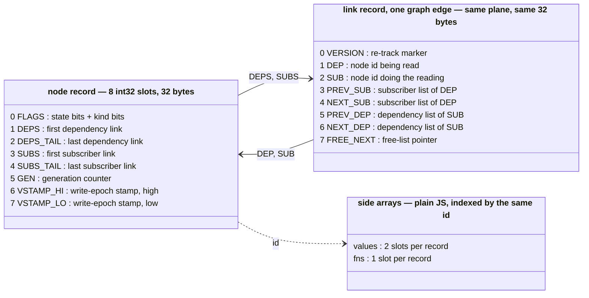
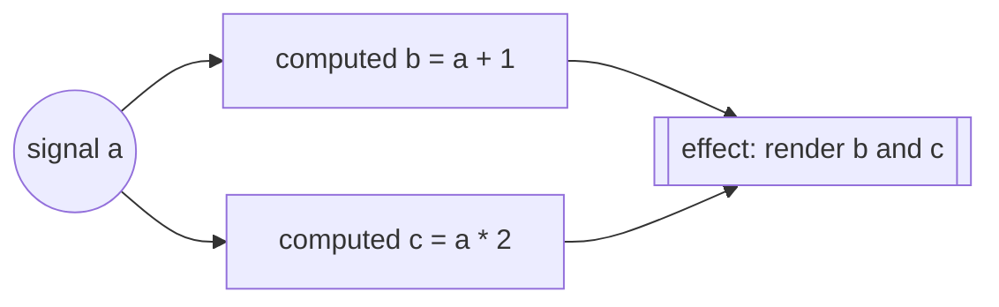
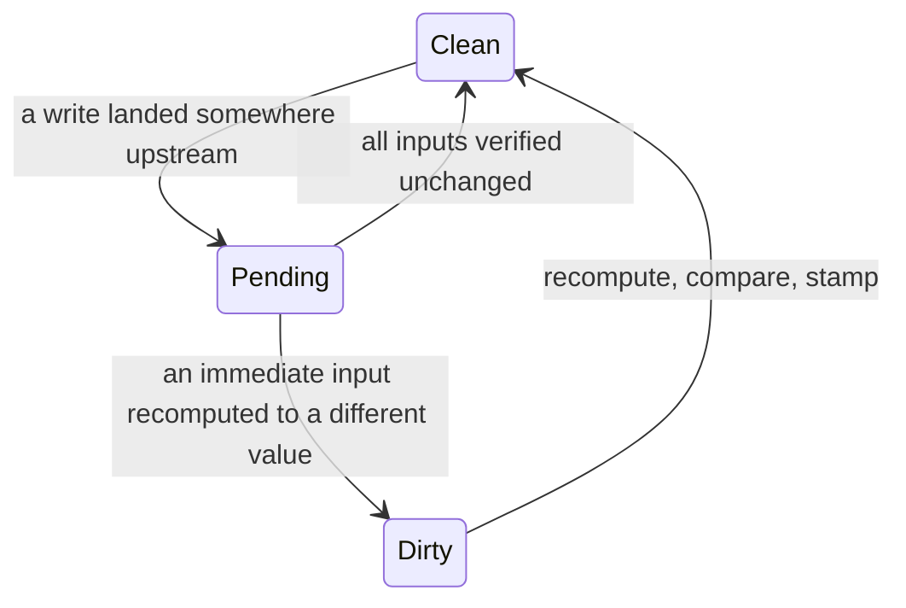

<p align="center">
	<br>
<p>

<p align="center">
	<a href="https://npmjs.com/package/dalien-signals"></a>
	<a href="https://deepwiki.com/justjake/dalien-signals"></a>
</p>

# dalien-signals

*d*alien-signals is a *d*ata-oriented fork of [alien-signals](https://github.com/stackblitz/alien-signals), a signals reactivity engine. It stores the alien-signals graph in a single `Int32Array` memory arena as contiguous structs, with associated JavaScript values and callbacks in side arrays. Here's a diagram of the data layout of structs in the graph, and their offsets:



Node records (signals, computeds, effects, scopes) and link records (the edges between them) interleave in the same plane, handed out by one bump pointer and recycled through free lists. Ids are pre-multiplied (`id = recordIndex × 8`) so every field access is a single indexed load, `M[id + SLOT]`, and record 0 is burned as *null* so every "is there a link?" check is `x !== 0`. Two side arrays indexed by the same id hold the only GC-visible parts: `values` (two slots per record — current value, plus staged value or effect cleanup) and `fns` (the getter or callback). The graph itself is invisible to the garbage collector.

Here's how our modified algorithm works:

**The primitives.** A **signal** is a box holding a value: `s()` reads it, `s(1)` writes it. A **computed** derives a new value from whatever it reads, and caches the result. An **effect** is a callback that does something visible — render, log, write — and must re-run when a value it read changes. While a computed or effect runs, the engine records an edge from everything it reads: dependencies are discovered, never declared. The records above are these nodes and edges:



After `a(5)`, the library's whole job is to bring `b`, `c`, and the effect up to date — each recomputed **at most once**, never letting the effect observe a half-updated world (`b` new but `c` stale), and recomputing nothing that nobody watches.

**Push, pull, push-pull.** The two obvious strategies each break one of those guarantees. *Eager push* — recompute everything downstream at write time — does work nobody may ever read, and in the diamond above naively runs the effect twice per write, once per path; the first of those runs sees the half-updated world (this is called a *glitch*). *Lazy pull* — recompute on read, re-checking dependencies every time — wastes nothing but makes every read walk the graph, and effects never find out they're stale. alien-signals, and therefore this fork, is **push-pull**: a write *pushes* only cheap flags down the graph, and then reads and queued effects *pull* real values up it, recomputing only what verifiably changed.

**The push half.** Writing a signal (with a value that differs — equal writes are no-ops) stages the value, marks the signal **dirty** ("definitely changed"), then walks downstream setting one flag on every reachable node: **pending** ("something above you *may* have changed"). Effects passed along the way are appended to a queue. No user code runs; the walk touches one 4-byte flags word per node and stops early wherever a branch is already marked.

**The pull half.** After the write — or at the end of a `startBatch()`/`endBatch()` group — the queue flushes. Each queued effect, and any computed you read, resolves its own flag first. *Pending* means: check your dependencies, in order. A pending dependency recurses first; a dirty one is recomputed on the spot — and only if its new value actually differs are its immediate subscribers promoted from pending to **dirty**. A recompute that produces an equal value stops the wave right there: subscribers are verified back to clean, and an effect whose inputs all settle back to equal values never runs at all. In the diamond, the effect runs once, after both `b` and `c` have settled — glitch-free by construction. A derived node's life:



**Our addition: the write epoch.** Upstream's pull still starts with a per-read flag protocol. This fork adds one global counter — the **write epoch**, bumped by every write anything observes — and stamps it into a node's `vstamp` slots whenever that node is verified or recomputed. A read whose stamp equals the current epoch has proof that *nothing anywhere* has been written since the node was last verified, and returns the cached value after one integer compare — no graph walk, no flags. Between writes, an app can re-read its entire derived state at array-index cost; the first read of each node after a write re-verifies and re-stamps it. The stamp is captured *before* verification begins, so a write fired from user code mid-verification can only make stamps miss, never lie.

## Optimizations

**The arena is the big one.** Storing the graph as integer records in one `Int32Array` instead of linked JavaScript objects is faster for three compounding reasons:

- **Cache locality.** Records are 32 bytes, packed side by side, so a propagation wave reads memory the CPU can prefetch. An object graph chases pointers to wherever the collector happened to place each node, and every hop is a potential cache miss.
- **Nothing to collect.** Linking and unlinking edges recycles integer records through free lists — steady-state graph maintenance allocates zero objects. The plane is one opaque array the garbage collector never traces into, so a large graph adds nothing to marking pauses; upstream's per-edge link objects are all individually visible to the GC.
- **Simple, stable machine code.** `M[id + FIELD]` compiles to shift-add-load — no hidden-class checks, no polymorphic property lookups. Kind bits live in the same flags word as state bits, so "is this a computed?" is a bit test on a value already in a register. And because the plane never grows or moves, every handle closure captures `const M` directly and reaches the graph with zero indirection.

The rest, each individually measured:

- **Quiet reads cost one compare** — the write-epoch stamps described above. A single clean read is about a nanosecond slower than upstream's flag check, but when many derived reads follow each write (the shape of the dynamic suite below), the stamps carry the win.
- **One- and two-hop updates skip the general machinery.** The most common real-app shapes — write one signal, one computed or one computed-feeding-an-effect recomputes — resolve through shallow fast paths in the dirty check, no traversal stacks. This is what moved the crossover against upstream to about two recomputed nodes (see Tradeoffs).
- **Call sites are pre-seeded past the JIT's speculation threshold.** Engines aggressively specialize a call site that only ever sees one function, then tear that code down when a second shape shows up — and a signals library funnels *your* getters and callbacks through a few internal call sites, so a growing app triggers that teardown repeatedly. When the graph reaches 33 nodes, this engine warms those call sites with assorted function shapes once, so performance stays flat as the app's callbacks diversify; tiny hot-loop programs never reach the threshold and keep full specialization. The number is measured, not chosen: everything in roughly [20, 45] performs identically, earlier taxes small programs, later exposes growing apps (`benchs/seedThreshold.mjs`, `benchs/phaseTransition.mjs`).
- **Leak-free by construction.** Dropped signal/computed handles reclaim their records through a required `FinalizationRegistry` (ES2021); getters are owned by their handles and only borrowed by the engine while subscribed, so no internal table can pin user closures. 10,000 live effects retain ~47% less heap than upstream, and computeds join the registry only at first evaluation — created-but-never-read computeds cost nothing.
- **Fixed capacity, allocated lazily.** `configure({ initialRecords })` sizes the plane before first use (default 2^23 records ≈ 256 MB of lazily-mapped virtual pages — physical memory tracks records actually touched). Importing the library allocates nothing.
- **`system.reset()` frees a whole generation at once**: rewind the plane, replace the registry. A dead graph costs the collector a few large objects instead of one weak cell per handle — exactly what request-scoped graphs, worker pools, and benchmark harnesses want. Every handle minted before a reset is invalid afterwards.
- **Inline budgets are load-bearing and tested.** V8 only inlines functions below a bytecode size limit, and several hot paths are split specifically to stay below it; `tests/bytecode.spec.ts` fails the build if a hot function outgrows its budget.

### Tradeoffs

What the data-oriented layout costs, relative to upstream's classic object graph:

- **You size it up front.** The plane is fixed capacity — that immovability is what the zero-indirection reads are built on. The default (256 MB of virtual, lazily-mapped pages) is effectively free until touched, and freed records recycle through free lists, but capacity must cover your peak count of *live* nodes and edges; exhausting it throws.
- **`FinalizationRegistry` is required** (ES2021). Reclamation of dropped signal/computed handles rides the garbage collector; there is no fallback mode.
- **Dedicated tiny hot loops favor upstream.** A benchmark-style loop over one small graph is the JIT's best case for upstream's objects: sustained small-update writes run 1.15–1.45× upstream's time there (`benchs/propagateSustained.mjs`, ~9% behind averaged over nine shapes). Part of that is the call-site seeding — deliberately trading peak single-shape speed for flatness. For scale, on the suite's most app-like test the gap is ~20 nanoseconds per update.
- **Deep chains favor upstream.** Nodes strung in a line are a pointer chase for both sides (upstream allocates in chain order too), and its fused pipeline stays ~15–35% cheaper until a chain passes about a thousand nodes.
- **Everything wider favors the arena.** The governing variable is **how many nodes one write recomputes** — not writes per batch, not graph size. The crossover sits at about **two recomputed nodes**: one-to-three-node waves land within noise of upstream (ratios 0.9–1.2 across shape families), and the advantage deepens past 2× at the largest measured cones. Beyond throughput, the arena's wins are the tails: burst updates, heap size, and GC churn over a long session.
- **`dalien-signals/system` is a new, incompatible interface** (a self-contained engine over integer handles). The package root is drop-in, except `getActiveSub()` returns a flags view object and handle functions are anonymous (`isSignal` and friends still work).


## Benchmarks

Below is the [js-reactivity-benchmark](https://github.com/milomg/js-reactivity-benchmark) suite (sbench, kairo, cellx, dynamic). The numbers are from CI and anyone can reproduce them: the [benchmark workflow](https://github.com/justjake/dalien-signals/actions/workflows/benchmark.yml) runs a pinned harness against this repo — dispatch it with `frameworks: ALL` for the full chart (these charts: run [28762874098](https://github.com/justjake/dalien-signals/actions/runs/28762874098) at c47c607). Methodology: each framework runs in its own process; each test reports the median of its runs (not the fastest, which hides amortized costs); frameworks run interleaved round-robin, four complete rounds each on its own runner, with per-test medians across rounds (`benchs/ci/` documents why that keeps ratios honest). The dalien adapter uses `reset()` between tests — the arena equivalent of the wholesale collection a dead GC-managed graph gets automatically.

**Node (V8)** — dalien-signals finishes first overall; upstream takes 7% longer:

<!-- benchmark:node:begin — generated by benchs/ci/pull-run.mjs; edits inside are overwritten -->


<details>
<summary>Node (V8) suite totals (ms, lower is better) — CI run 28762874098 @ c47c607, 2026-07-06</summary>

| framework              | sbench | kairo | cellx | dynamic | total |
| ---------------------- | -----: | ----: | ----: | ------: | ----: |
| Dalien Signals         |    736 |  1002 |    41 |    2209 |  3989 |
| Reactively             |    657 |  1174 |    98 |    2175 |  4104 |
| Alien Signals          |    716 |   946 |    40 |    2569 |  4273 |
| Preact Signals         |    574 |   990 |    35 |    3193 |  4793 |
| s-js                   |    750 |  1228 |    48 |    3678 |  5704 |
| Vue                    |    861 |  1499 |    88 |    3816 |  6264 |
| Svelte v5              |   1470 |  2105 |    52 |    4029 |  7656 |
| Pota                   |   1565 |  2048 |   135 |    4529 |  8277 |
| amadeus-it-group/tansu |   2787 |  1735 |   150 |    3774 |  8445 |
| Angular Signals        |   1683 |  1853 |   122 |    5621 |  9279 |
| SolidJS                |   1432 |  2189 |    94 |    6700 | 10414 |
| x-reactivity           |   2892 |  3052 |   168 |    7306 | 13418 |
| MobX                   |   4462 |  4721 |   223 |    9539 | 18946 |
| Compostate             |   2435 |  3507 |   287 |   14139 | 20368 |


</details>
<!-- benchmark:node:end -->

**Bun (JavaScriptCore)** — first overall again; upstream takes 39% longer:

<!-- benchmark:bun:begin — generated by benchs/ci/pull-run.mjs; edits inside are overwritten -->


<details>
<summary>Bun (JavaScriptCore) suite totals (ms, lower is better) — CI run 28762874098 @ c47c607, 2026-07-06</summary>

| framework              | sbench | kairo | cellx | dynamic | total |
| ---------------------- | -----: | ----: | ----: | ------: | ----: |
| Dalien Signals         |    559 |   638 |    28 |    1847 |  3073 |
| Reactively             |    498 |  1171 |    69 |    1900 |  3638 |
| Alien Signals          |    744 |   770 |    39 |    2713 |  4267 |
| Preact Signals         |    733 |   710 |    37 |    2791 |  4270 |
| s-js                   |    712 |   937 |    34 |    3290 |  4973 |
| Vue                    |    856 |   963 |    76 |    3573 |  5467 |
| Angular Signals        |   1596 |  1126 |    76 |    3393 |  6191 |
| Svelte v5              |   1182 |  1650 |    52 |    3508 |  6391 |
| Pota                   |   1190 |  2098 |   108 |    5120 |  8516 |
| amadeus-it-group/tansu |   2920 |  1753 |   237 |    4402 |  9312 |
| SolidJS                |   1152 |  1832 |   114 |    6460 |  9558 |
| x-reactivity           |   2352 |  2082 |   163 |    5622 | 10219 |
| MobX                   |   2515 |  3493 |   188 |    7704 | 13900 |
| Compostate             |   1992 |  3037 |   341 |   25942 | 31312 |


</details>
<!-- benchmark:bun:end -->

The [transitive-bullshit fork](https://github.com/transitive-bullshit/js-reactivity-benchmark) of the same suite runs every framework in one shared Node process — the methodology behind the upstream alien-signals chart further down. `alien-signals` here is the 1.0.0-alpha.1 that repo pins; `alien-signals-v3` is the v3.2.1 this fork tracks. Read it with two caveats: shared-process totals are order-sensitive (each framework inherits the JIT and heap state of whatever ran before it — in our testing, reordering frameworks changed relative results materially), and its creation tests end their timed region with a forced full GC over ~100k just-abandoned nodes, which bills dalien-signals' `FinalizationRegistry` cells inside the timing while upstream's dead nodes are ordinary garbage. That one suite accounts for most of the gap to upstream below. Node 24, Apple M4 Max, 2026-07-06; raw data in `benchs/results/`.

<!-- benchmark:tb:begin — generated by benchs/ci/pull-run.mjs; edits inside are overwritten -->


<details>
<summary>Suite totals (ms, lower is better)</summary>

| framework                   | sbench | kairo | dynamic | total |
| --------------------------- | -----: | ----: | ------: | ----: |
| alien-signals 1.0.0-alpha.1 |     32 |   907 |     735 |  1674 |
| alien-signals v3.2.1        |     50 |   985 |     871 |  1906 |
| dalien-signals              |    551 |  1106 |     941 |  2598 |
| @reactively                 |    673 |  1336 |     999 |  3007 |
| Svelte v5                   |    651 |  1561 |    1113 |  3325 |
| s-js                        |    778 |  1539 |    1471 |  3788 |
| @amadeus-it-group/tansu     |    713 |  1845 |    1440 |  3998 |
| Oby                         |    863 |  1789 |    1472 |  4125 |
| $mol_wire                   |    688 |  2085 |    1459 |  4232 |
| uSignal                     |    688 |  2390 |    1912 |  4990 |
| Preact Signals              |    665 |  1108 |    3301 |  5074 |
| SolidJS                     |    840 |  2097 |    2559 |  5497 |
| MobX                        |    737 |  3578 |    2850 |  7165 |
| Signia                      |    699 |  1792 |    4917 |  7409 |
| @vue/reactivity             |    709 |  1873 |    5563 |  8145 |
| TC39 Signals Polyfill       |    771 |  3296 |   13530 | 17597 |
| @angular/signals            |    715 |  2437 |   18392 | 21544 |


</details>
<!-- benchmark:tb:end -->

---

# About alien-signals upstream

`alien-signals` explores a push-pull based signal algorithm. The implementation is related to the following frontend projects:

- Propagation algorithm of Vue 3
- Preact’s double-linked-list approach (https://preactjs.com/blog/signal-boosting/)
- Inner effects scheduling of Svelte
- Graph-coloring approach of Reactively (https://milomg.dev/2022-12-01/reactivity)

We impose some constraints (such as not using Array/Set/Map and disallowing function recursion in [the algorithmic core](https://github.com/stackblitz/alien-signals/blob/master/src/system.ts)) to ensure performance. We found that under these conditions, maintaining algorithmic simplicity offers more significant improvements than complex scheduling strategies.

I wrote the reactivity code for both Vue and alien-signals. Below is a benchmark comparison against Vue 3.4 and other frameworks. The core algorithm has since been [ported back to Vue 3.6](https://github.com/vuejs/core/pull/12349).


> Benchmark repo: https://github.com/transitive-bullshit/js-reactivity-benchmark

## Background

I spent considerable time [optimizing Vue 3.4’s reactivity system](https://github.com/vuejs/core/pull/5912), gaining experience along the way. Since Vue 3.5 [switched to a pull-based algorithm similar to Preact](https://github.com/vuejs/core/pull/10397), I decided to continue researching a push-pull based implementation in a separate project. The algorithm is used in Vue language tools for incremental AST parsing and virtual code generation.

## Other Language Implementations

- **Dart:** [medz/alien-signals-dart](https://github.com/medz/alien-signals-dart)
- **Dart:** [void-signals/void_signals](https://github.com/void-signals/void_signals)
- **Lua:** [YanqingXu/alien-signals-in-lua](https://github.com/YanqingXu/alien-signals-in-lua)
- **Lua 5.4:** [xuhuanzy/alien-signals-lua](https://github.com/xuhuanzy/alien-signals-lua)
- **Luau:** [Nicell/alien-signals-luau](https://github.com/Nicell/alien-signals-luau)
- **Java:** [CTRL-Neo-Studios/java-alien-signals](https://github.com/CTRL-Neo-Studios/java-alien-signals)
- **C#:** [CTRL-Neo-Studios/csharp-alien-signals](https://github.com/CTRL-Neo-Studios/csharp-alien-signals)
- **Go:** [delaneyj/alien-signals-go](https://github.com/delaneyj/alien-signals-go)
- **Rust:** [wuzekang/samara-signals](https://github.com/wuzekang/samara/tree/main/crates/signals)
- **Rust:** [ohkami-rs/alien-signals-rs](https://github.com/ohkami-rs/alien-signals-rs)

## Derived Projects

- [Rajaniraiyn/react-alien-signals](https://github.com/Rajaniraiyn/react-alien-signals): React bindings for the alien-signals API
- [CCherry07/alien-deepsignals](https://github.com/CCherry07/alien-deepsignals): Use alien-signals with the interface of a plain JavaScript object
- [hunghg255/reactjs-signal](https://github.com/hunghg255/reactjs-signal): Share Store State with Signal Pattern
- [gn8-ai/universe-alien-signals](https://github.com/gn8-ai/universe-alien-signals): Enables simple use of the Alien Signals state management system in modern frontend frameworks
- [WebReflection/alien-signals](https://github.com/WebReflection/alien-signals): Preact signals like API and a class based approach for easy brand check
- [@lift-html/alien](https://github.com/JLarky/lift-html/tree/main/packages/alien): Integrating alien-signals into lift-html
- [ilha](https://github.com/ilhajs/ilha): A tiny web UI library built around the islands architecture
- [@sigrea/core](https://github.com/sigrea/core): Signals, deep reactivity, and molecule lifecycles built on alien-signals
- [@lazy-promise/alien-signals](https://github.com/lazy-promise/lazy-promise/tree/main/packages/alien-signals): Async signals built on top of alien-signals and LazyPromise

## Adoption

- [vuejs/core](https://github.com/vuejs/core): The core algorithm has been ported to v3.6 (PR: https://github.com/vuejs/core/pull/12349)
- [statelyai/xstate](https://github.com/statelyai/xstate): The core algorithm has been ported to implement the atom architecture (PR: https://github.com/statelyai/xstate/pull/5250)
- [flamrdevs/xignal](https://github.com/flamrdevs/xignal): Infrastructure for the reactive system
- [vuejs/language-tools](https://github.com/vuejs/language-tools): Used in the language-core package for virtual code generation
- [unuse](https://github.com/un-ts/unuse): A framework-agnostic `use` library inspired by `VueUse`

## Usage

#### Basic APIs

```ts
import { signal, computed, effect } from "alien-signals";

const count = signal(1);
const doubleCount = computed(() => count() * 2);

effect(() => {
  console.log(`Count is: ${count()}`);
}); // Console: Count is: 1

console.log(doubleCount()); // 2

count(2); // Console: Count is: 2

console.log(doubleCount()); // 4
```

#### Effect Scope

```ts
import { signal, effect, effectScope } from "alien-signals";

const count = signal(1);

const stopScope = effectScope(() => {
  effect(() => {
    console.log(`Count in scope: ${count()}`);
  }); // Console: Count in scope: 1
});

count(2); // Console: Count in scope: 2

stopScope();

count(3); // No console output
```

#### Nested Effects

Effects can be nested inside other effects. When the outer effect re-runs, inner effects from the previous run are automatically cleaned up, and new inner effects are created if needed. The system ensures proper execution order — outer effects always run before their inner effects:

```ts
import { signal, effect } from "alien-signals";

const show = signal(true);
const count = signal(1);

effect(() => {
  if (show()) {
    // This inner effect is created when show() is true
    effect(() => {
      console.log(`Count is: ${count()}`);
    });
  }
}); // Console: Count is: 1

count(2); // Console: Count is: 2

// When show becomes false, the inner effect is cleaned up
show(false); // No output

count(3); // No output (inner effect no longer exists)
```

#### Manual Triggering

The `trigger()` function allows you to manually trigger updates for downstream dependencies when you've directly mutated a signal's value without using the signal setter:

```ts
import { signal, computed, trigger } from "alien-signals";

const arr = signal<number[]>([]);
const length = computed(() => arr().length);

console.log(length()); // 0

// Direct mutation doesn't automatically trigger updates
arr().push(1);
console.log(length()); // Still 0

// Manually trigger updates
trigger(arr);
console.log(length()); // 1
```

You can also trigger multiple signals at once:

```ts
import { signal, computed, trigger } from "alien-signals";

const src1 = signal<number[]>([]);
const src2 = signal<number[]>([]);
const total = computed(() => src1().length + src2().length);

src1().push(1);
src2().push(2);

trigger(() => {
  src1();
  src2();
});

console.log(total()); // 2
```

#### Creating Your Own Surface API

You can reuse alien-signals’ core algorithm via `createReactiveSystem()` to build your own signal API. For implementation examples, see:

- [Starter template](https://github.com/johnsoncodehk/alien-signals-starter) (implements `.get()` & `.set()` methods like the [Signals proposal](https://github.com/tc39/proposal-signals))
- [stackblitz/alien-signals/src/index.ts](https://github.com/stackblitz/alien-signals/blob/master/src/index.ts)
- [proposal-signals/signal-polyfill#44](https://github.com/proposal-signals/signal-polyfill/pull/44)

## About `propagate` and `checkDirty` functions

The actual implementations of `propagate` and `checkDirty` in [system.ts](https://github.com/stackblitz/alien-signals/blob/master/src/system.ts) replace recursive calls with iterative stack-based traversal for performance. The recursive versions below are equivalent and easier to follow — useful as a reference when porting to other languages where the iterative optimization may not help.

<details>
<summary><code>propagate</code></summary>

```ts
function propagate(link: Link, innerWrite: boolean): void {
  do {
    const sub = link.sub;

    let flags = sub.flags;

    if (
      !(
        flags &
        (ReactiveFlags.RecursedCheck |
          ReactiveFlags.Recursed |
          ReactiveFlags.Dirty |
          ReactiveFlags.Pending)
      )
    ) {
      sub.flags = flags | ReactiveFlags.Pending;
      if (innerWrite) {
        sub.flags |= ReactiveFlags.Recursed;
      }
    } else if (
      !(flags & (ReactiveFlags.RecursedCheck | ReactiveFlags.Recursed))
    ) {
      flags = ReactiveFlags.None;
    } else if (!(flags & ReactiveFlags.RecursedCheck)) {
      sub.flags = (flags & ~ReactiveFlags.Recursed) | ReactiveFlags.Pending;
    } else if (
      !(flags & (ReactiveFlags.Dirty | ReactiveFlags.Pending)) &&
      isValidLink(link, sub)
    ) {
      sub.flags = flags | ReactiveFlags.Recursed | ReactiveFlags.Pending;
      flags &= ReactiveFlags.Mutable;
    } else {
      flags = ReactiveFlags.None;
    }

    if (flags & ReactiveFlags.Watching) {
      notify(sub);
    }

    if (flags & ReactiveFlags.Mutable) {
      const subSubs = sub.subs;
      if (subSubs !== undefined) {
        propagate(subSubs, innerWrite);
      }
    }

    link = link.nextSub!;
  } while (link !== undefined);
}
```

</details>

<details>
<summary><code>checkDirty</code></summary>

```ts
function checkDirty(link: Link, sub: ReactiveNode): boolean {
  do {
    const dep = link.dep;
    const depFlags = dep.flags;

    if (sub.flags & ReactiveFlags.Dirty) {
      return true;
    } else if (
      (depFlags & (ReactiveFlags.Mutable | ReactiveFlags.Dirty)) ===
      (ReactiveFlags.Mutable | ReactiveFlags.Dirty)
    ) {
      if (update(dep)) {
        const subs = dep.subs!;
        if (subs.nextSub !== undefined) {
          shallowPropagate(subs);
        }
        return true;
      }
    } else if (
      (depFlags & (ReactiveFlags.Mutable | ReactiveFlags.Pending)) ===
      (ReactiveFlags.Mutable | ReactiveFlags.Pending)
    ) {
      if (checkDirty(dep.deps!, dep)) {
        if (update(dep)) {
          const subs = dep.subs!;
          if (subs.nextSub !== undefined) {
            shallowPropagate(subs);
          }
          return true;
        }
      } else {
        dep.flags = depFlags & ~ReactiveFlags.Pending;
      }
    }

    link = link.nextDep!;
  } while (link !== undefined);

  return false;
}
```

</details>
