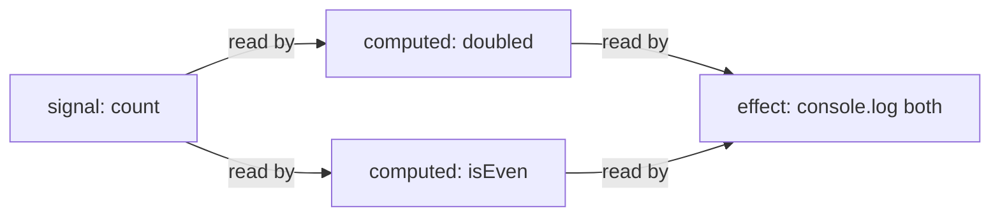
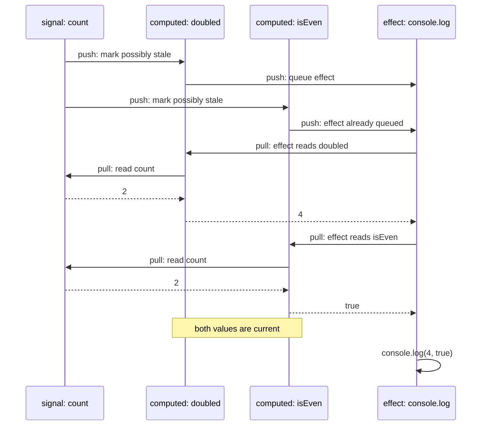
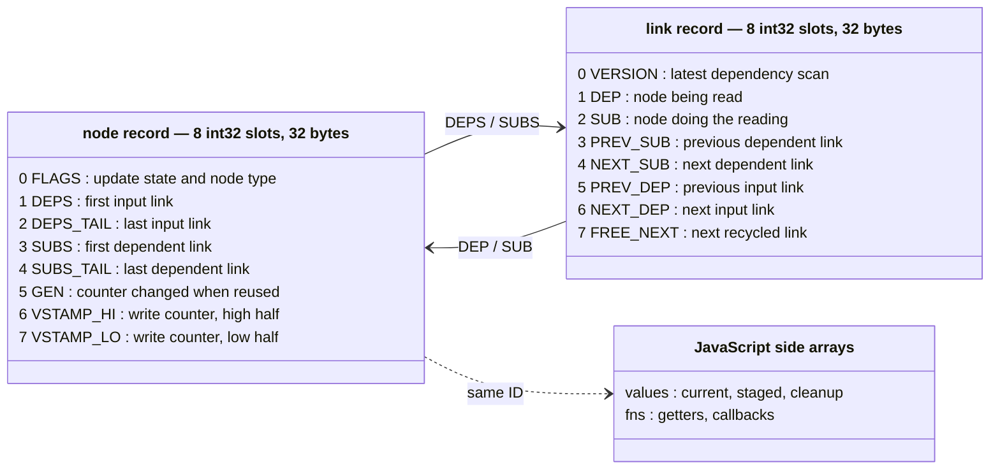
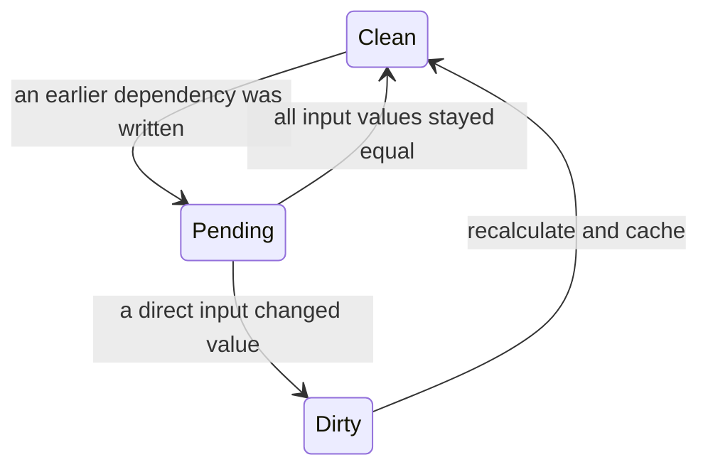

<p align="center">
	<br>
</p>

<p align="center">
	<a href="https://npmjs.com/package/dalien-signals"></a>
	<a href="https://deepwiki.com/justjake/dalien-signals"></a>
</p>

# dalien-signals

**d**alien-signals is a **d**ata-oriented fork of [alien-signals][], a fast [signals][tc39] reactivity library. Its reactive dependency graph is stored in a single `Int32Array` memory [arena][arena-wikipedia], like a contiguous array of structs in C.

The default arena reserves 64 MB of address space (2,097,152 records of 32 bytes). Large zero-filled buffers are typically demand-paged, or lazily committed: allocation reserves virtual address space, but resident physical memory grows only as pages are touched. `growCapacity()` raises the reservation for bigger graphs, and the arena also grows itself when it fills.

Demo with interactive examples: [justjake.github.io/dalien-signals](https://justjake.github.io/dalien-signals/).

## How it works

`dalien-signals` keeps calculations and callbacks in sync with changing values. It provides three main primitives:

- A `signal` stores a value. Call it with no argument to read it, or with an argument to write it.
- A `computed` derives and caches a value from signals or other computeds.
- An `effect` runs a function now, then again when a value it read changes.

Dependencies are automatic. While a computed or effect runs, the library records every signal and computed it reads.

```ts
import { computed, effect, signal } from "dalien-signals";

const count = signal(1);
const doubled = computed(() => count() * 2);
const isEven = computed(() => count() % 2 === 0);

effect(() => console.log(doubled(), isEven())); // 2 false
count(2); // 4 true
```



Arrows point from a value to the work that depends on it. When `count` changes, the effect is reached through both computeds but queued only once.

Recalculating every downstream node on each write would waste work. Recalculating dependents immediately could also run an effect more than once or before all of its inputs are current. Updates instead use a push-pull algorithm:

1. **Push:** a write marks downstream computeds and effects as possibly stale. Effects are queued, but no user callback runs during this graph walk.
2. **Pull:** before a computed returns its value, it checks its dependencies and recalculates if necessary. A queued effect reruns and pulls each computed it reads up to date. If a computed's value has not changed, the update stops along that path.



## API

The library has two interfaces over the same graph, distinguished by what
a "reactive value" is in your hands:

- **The function tier** — `signal`, `computed`, `effect`, `effectScope` —
  returns callables: `count()` reads, `count(1)` writes, and calling an
  effect's returned function stops it. Each callable **owns its record**:
  the engine registers it with a `FinalizationRegistry`, so dropping the
  last reference reclaims the node's memory automatically. This is the
  default, the leak-free choice, and the interface all published
  benchmarks measure.
- **The id tier** — `signalId`, `computedId`, `effectId`, `effectScopeId`
  with `get`, `set`, and `dispose` — returns the record's integer id
  itself. Nothing is allocated per node beyond the 32-byte record, and
  nothing is garbage-collected for you: an id lives until you `dispose`
  it, its creating effect scope is disposed, or an `owner` object you
  passed at creation is collected. Ids are what the arena actually
  stores; the function tier is a thin ownership layer over them.

Choose by lifetime discipline, not by speed: reads and writes go through
the same engine paths, and creation differs by one closure per node.
Frameworks embedding the graph — storing ids in their own structures,
managing lifetimes with their own model — use the id tier; application
code uses functions. The tiers interoperate in one graph: an id-tier
computed can read function-tier signals and vice versa.

```ts
import { signal, get, set, signalId, dispose } from "dalien-signals";

const count = signal(0); // function tier: GC-owned callable
count(1);

const id = signalId(0); // id tier: a plain integer
set(id, get(id) + 1);
dispose(id); // explicit end of life
```

The function tier in full:

````ts
import type { SignalId } from "dalien-signals/system";

/** Return the id of the node currently recording signal reads (0 = none). */
export declare function getActiveSub(): SignalId;

/**
 * Set the node that records subsequent reads.
 * Returns the previous id so it can be restored.
 */
export declare function setActiveSub(sub?: SignalId): SignalId;

/**
 * Raise the arena's capacity to at least `records` 32-byte records (no-op
 * if already that big). Best called before building a large graph so it
 * never grows mid-flight. The default capacity is 2,097,152 records.
 *
 * @example
 * ```ts
 * growCapacity(1 << 22);
 * const count = signal(0);
 * ```
 */
export declare function growCapacity(records: number): void;

/** Return the number of currently open batches. */
export declare function getBatchDepth(): number;

/**
 * Open a batch. Queued effects wait for the matching `endBatch()`.
 *
 * @example
 * ```ts
 * const count = signal(0);
 * effect(() => console.log(count())); // 0
 * startBatch();
 * try {
 *   count(1);
 *   count(2);
 * } finally {
 *   endBatch(); // 2; the effect runs once.
 * }
 * ```
 */
export declare function startBatch(): void;

/** Close a batch, flushing effects when the outermost batch closes. */
export declare function endBatch(): void;

/** Return whether `fn` is a signal created by this package. */
export declare function isSignal(fn: () => void): boolean;

/** Return whether `fn` is a computed created by this package. */
export declare function isComputed(fn: () => void): boolean;

/** Return whether `fn` is an effect disposer created by this package. */
export declare function isEffect(fn: () => void): boolean;

/** Return whether `fn` is an effect-scope disposer created by this package. */
export declare function isEffectScope(fn: () => void): boolean;

/**
 * Create a reactive value. Call the returned function with no argument to
 * read the value, or with an argument to write it.
 *
 * @example
 * ```ts
 * const count = signal(0);
 * count();  // 0
 * count(1);
 * count();  // 1
 * ```
 */
export declare function signal<T>(): {
  (): T | undefined;
  (value: T | undefined): void;
};
export declare function signal<T>(initialValue: T): {
  (): T;
  (value: T): void;
};

/**
 * Create a cached value derived from the signals and computeds read by
 * `getter`. Its argument is the previous value, or `undefined` initially.
 *
 * @example
 * ```ts
 * const count = signal(2);
 * const doubled = computed(() => count() * 2);
 * doubled(); // 4
 * count(3);
 * doubled(); // 6
 * ```
 */
export declare function computed<T>(getter: (previousValue?: T) => T): () => T;

/**
 * Run `fn` immediately, then rerun it when a value it read changes.
 * `fn` may return cleanup work. The returned function stops the effect.
 *
 * @example
 * ```ts
 * const count = signal(0);
 * const stop = effect(() => console.log(count())); // 0
 * count(1); // 1
 * stop();
 * ```
 */
export declare function effect(fn: () => void | (() => void)): () => void;

/**
 * Run `fn` and group every nested effect it creates.
 * The returned function stops the group and runs its cleanup work.
 *
 * @example
 * ```ts
 * const count = signal(0);
 * const stop = effectScope(() => {
 *   effect(() => console.log(count()));
 * });
 * stop();
 * count(1); // No log; the scope is stopped.
 * ```
 */
export declare function effectScope(fn: () => void): () => void;

/**
 * Notify dependents after mutating values stored inside signals in place.
 * Read each changed signal inside `fn`.
 *
 * @example
 * ```ts
 * const items = signal<string[]>([]);
 * const size = computed(() => items().length);
 * size(); // 0
 * items().push('one');
 * trigger(items);
 * size(); // 1
 * ```
 */
export declare function trigger(fn: () => void): void;
````

The id tier mirrors the functions above: `signalId(initialValue?, owner?)`,
`computedId(getter, owner?)`, `effectId(fn)`, and `effectScopeId(fn)`
return `SignalId`s; `get(id)` / `set(id, value)` read and write;
`dispose(id)` frees effects, scopes, or records explicitly; `getFlags` /
`setFlags` expose the node's engine state bits. Ids created inside an
`effectScopeId` belong to that scope's region and are freed with it; ids
created with an `owner` object are freed when the owner is collected;
bare ids are the caller's responsibility.

The `dalien-signals/system` entry point exposes isolated engines, the raw
graph operations, debugging, and bulk reset.

## Storage

Internally, each signal, computed, effect, or scope is a node. Each dependency is a link. Both use eight-slot, 32-byte records in one fixed-capacity `Int32Array`, JavaScript's typed array of 32-bit integers:



- This array is the **arena**. An ID is a record's starting offset within it; ID `0` means “no record.”
- A free list chains unused records together so they can be recycled without allocating new edge objects.
- Side arrays hold values, cleanup functions, getters, and callbacks.

`FLAGS` stores the node type and update state. A computed moves through three states:



- **Clean:** the cached value is current. This state has no `ReactiveFlags.Dirty` or `ReactiveFlags.Pending` bit.
- **Pending:** an input may have changed, so the node must check its inputs before deciding whether to recalculate.
- **Dirty:** a direct input changed, so the node must recalculate before returning its value.

Effects use the same pending-versus-dirty distinction to decide whether their callbacks need to rerun. The live `.flags` object returned by `getActiveSub()` exposes these bits:

| bit | name                          | meaning                                                                           |
| --: | ----------------------------- | --------------------------------------------------------------------------------- |
|   0 | `ReactiveFlags.Mutable`       | Changes can continue through this node to its dependents.                         |
|   1 | `ReactiveFlags.Watching`      | This node is an effect that should be queued when reached.                        |
|   2 | `ReactiveFlags.RecursedCheck` | The engine is watching for a write that loops back into the callback now running. |
|   3 | `ReactiveFlags.Recursed`      | Such a recursive write reached this node.                                         |
|   4 | `ReactiveFlags.Dirty`         | This node is known to need an update.                                             |
|   5 | `ReactiveFlags.Pending`       | An earlier dependency may require this node to update.                            |
|   6 | `HAS_CHILD_EFFECT` (internal) | This node owns nested effects that require ordered cleanup.                       |

Bits identifying the node type or tracking record recycling are engine-only and are hidden from that object. `ReactiveFlags`, exported by `dalien-signals/system`, names bits 0–5 so integrations do not need to hard-code their numeric values.

Whenever a write could invalidate cached work, the engine increments a global write counter, called the **epoch**. After checking or recalculating a computed, it saves the epoch into the record's stamp — one float64 spanning slots 6–7, read through a `Float64Array` view over the same arena (a 53-bit counter never wraps, and one load-and-compare replaces two). If the saved and current epochs match on the next read, no write that could affect the cache occurred in between, so the value can be returned without walking the graph. If a callback writes another signal during the check, the current epoch advances and the saved value no longer matches.

## Performance details

- One- and two-link updates use dedicated fast paths instead of the general graph traversal. Runs of single-dependency, single-subscriber nodes — chains — walk without the traversal stack: the way back up is recoverable from each node's unique subscriber link.
- A `FinalizationRegistry` tracks when signal or computed functions are GC'd and returns their underlying record memory to a free-list for re-use.
- The lower-level engine's `reset()` method clears the whole arena at once. Functions and numeric IDs created before the reset become invalid.
- `tests/bytecode.spec.ts` enforces V8's 460-bytecode inline limit for hot functions. Large functions are split so the JIT can inline them into callers.

## Build your own framework

`createReactiveSystem` is the graph engine with none of the signal semantics: five raw operations over the arena, allocation, growth, and a set of seams the host fills in. `src/index.ts` — the whole default library — is one client of this surface (`tests/policyBoundary.spec.ts` enforces that it uses nothing else). A host can bring its own semantics:

```ts
import { createReactiveSystem } from "dalien-signals/system";

const sys = createReactiveSystem({
  // Required: the arena's capacity, in records or megabytes (1 MB = 32,768
  // records). maxCapacityRecords / maxCapacityMegabytes cap growth.
  capacityRecords: 1 << 16,

  // Fires at creation and after every growth: capture the arena here. The
  // object is replaced when the arena grows, so hosts re-capture rather
  // than holding fields.
  allocated(arena) {
    // arena.memory: Int32Array — the records themselves
    // arena.versions: Float64Array — the same buffer, for version stamps
    // arena.link(dep, sub, version) / arena.unlink(linkId, sub?)
    // arena.propagate(subsLink, innerWrite) / arena.checkDirty(depsLink, sub)
    // arena.shallowPropagate(subsLink)
    // arena.allocNode(hostBits) / arena.freeNode(id, gen)
  },

  // The walks call this for every stale node: commit whatever "update"
  // means for your kind (dispatch on your own host bits in `flags`) and
  // return whether the value changed — it feeds the equality cut-off.
  update(id, flags) { return true; },

  // An effect needs to run: queue it however you schedule work.
  notify(id, gen) {},

  // A node gained its first subscriber / lost its last one. Connect and
  // disconnect external resources here; `unwatched` also fires for every
  // watched node during reset().
  watched(id) {},
  unwatched(id, state) {},

  // A record went back to the free list: drop anything you keep for it
  // (values, callbacks), or dead objects stay pinned until the id is
  // reused.
  freed(id) {},
});

// Lifetime tiers on the system object:
sys.createNode(owner, hostBits); // automatic: freed when `owner` is GC'd
sys.adoptNode(owner, id);        // tie an already-created id to an owner
sys.allocNode(hostBits);         // manual: pair with disposeNode/freeNode
sys.disposeNode(id, gen?);       // gen-guarded free; stale ids are no-ops
sys.generationOf(id);            // capture at creation to guard stored ids
sys.growCapacity(records);       // immediate when idle, else at the next boundary
sys.reset();                     // rewind the whole arena; every id dies
sys.stats();                     // capacity, live records, free-list depth
```

Node state lives in the arena as 32-byte records of eight `int32` slots — flags, dependency-list head and cursor, subscriber-list head and tail, a generation counter, and a float64 version stamp. Edges are records too. The [live inspector](https://justjake.github.io/dalien-signals/) decodes a real arena, record by record, as you mutate a graph.

`tests/hostPrimitives.spec.ts` is the proof: signal, computed, and effect implemented entirely from this surface — glitch-free diamonds, equality cut-off, batching, re-tracking, implicit stamping — interoperating both directions with the built-ins in one graph, at parity on the benchmark suite.

## Constraints

- The arena grows between operations. Once 3/4 full, the engine and the library's hot tier are rebuilt over an arena twice the size; every record is copied and existing signals keep working. Both rebuilds compile from freshly generated source (`new Function`) so each generation keeps the JIT specialization a repeated closure would lose. Growing **before** a graph is built runs at full speed afterwards; growing under an already-hot graph leaves long-lived callables with mixed call-site feedback, measured at ~1.3x on sustained recompute chains — call `growCapacity()` up front for graphs you expect to be large. Where Content-Security-Policy forbids runtime codegen, growth falls back to plain instantiation: correct, with the same mixed-feedback cost.
- Growth cannot move the arena under a running callback. A single effect or computed callback that allocates past the remaining quarter of the arena throws; `growCapacity()` raises capacity up front for allocation-heavy paths. The default reservation is 64 MB of address space (2,097,152 records); physical memory is consumed only for records that are touched.
- The JavaScript runtime must support `FinalizationRegistry`, which is part of ES2021.
- Across the write-cost crossover matrix (5 shape families x 10 sizes, `benchs/crossover.mjs`, Node 24, Apple M4 Max, 2026-07-07), this arena averages ~11% faster than the original `alien-signals` (geometric mean ratio 0.89) and reaches 1.9-2.9x faster once a write recomputes hundreds of nodes (grid cones bottom out at 0.34x, broad fan-outs at 0.5-0.6x). The remaining upstream edge is a narrow band: single-node and few-node writes run up to ~1.1x this fork's time, and a fixed cone surrounded by idle nodes carries a flat ~10% premium. `benchs/propagateSustained.mjs` and `benchs/memoryUsage.mjs` probe the adjacent regimes.


The chart divides dalien-signals time by alien-signals time. Values below `1.0` mean dalien-signals was faster; values above `1.0` mean alien-signals was faster.

## Benchmarks

These charts compare JavaScript reactivity libraries with the `sbench`, `kairo`, `cellx`, and `dynamic` workload groups from [js-reactivity-benchmark](https://github.com/milomg/js-reactivity-benchmark). Each table reports elapsed milliseconds; lower is better, and `total` is the sum of those workload groups.

The first two charts run each library in a fresh process, so one library cannot leave compiled code or uncollected objects behind for the next. Each number is the median of four CI rounds; the libraries take turns each round instead of completing all runs in a fixed order. See [run 28848044239](https://github.com/justjake/dalien-signals/actions/runs/28848044239) at `ae1b4ae`; `benchs/ci/` contains the harness and method. On Node, dalien-signals posts the lowest total of every framework measured.

### Node (V8)

<!-- benchmark:node:begin — generated by benchs/ci/pull-run.mjs; edits inside are overwritten -->


<details>
<summary>Node (V8) suite totals (ms, lower is better) — CI run 28883585345 @ a205758, 2026-07-07</summary>

| framework | sbench | kairo | cellx | dynamic | total |
| --- | ---: | ---: | ---: | ---: | ---: |
| Dalien Id Alloc/Free | 595 | 870 | 23 | 1863 | 3351 |
| Reactively | 683 | 1029 | 50 | 1623 | 3384 |
| Alien Signals | 683 | 838 | 41 | 1884 | 3447 |
| Dalien Signals | 577 | 901 | 29 | 1964 | 3471 |
| Preact Signals | 565 | 893 | 38 | 2295 | 3792 |
| s-js | 725 | 1150 | 68 | 3134 | 5077 |
| Vue | 835 | 1403 | 94 | 3147 | 5478 |
| Svelte v5 | 1625 | 2163 | 59 | 3552 | 7399 |
| amadeus-it-group/tansu | 2663 | 1559 | 217 | 3066 | 7504 |
| Pota | 1567 | 2018 | 132 | 4134 | 7851 |
| Angular Signals | 1580 | 1812 | 110 | 4836 | 8337 |
| SolidJS | 1354 | 2064 | 142 | 5973 | 9533 |
| x-reactivity | 2759 | 2886 | 187 | 6136 | 11967 |
| MobX | 4286 | 4512 | 214 | 9015 | 18028 |
| Compostate | 2276 | 3277 | 350 | 13818 | 19721 |


</details>
<!-- benchmark:node:end -->

### Bun (JavaScriptCore)

Bun's JavaScriptCore currently runs this library well behind alien-signals (the engine work above is tuned against V8, and the current host structure regressed JSC from the previous release, which beat alien-signals under Bun at 0.84x). Treat the Bun numbers as a known issue under active investigation rather than a stable property.

<!-- benchmark:bun:begin — generated by benchs/ci/pull-run.mjs; edits inside are overwritten -->


<details>
<summary>Bun (JavaScriptCore) suite totals (ms, lower is better) — CI run 28883585345 @ a205758, 2026-07-07</summary>

| framework | sbench | kairo | cellx | dynamic | total |
| --- | ---: | ---: | ---: | ---: | ---: |
| Dalien Id Alloc/Free | 562 | 722 | 28 | 1955 | 3267 |
| Reactively | 445 | 1123 | 69 | 1703 | 3340 |
| Dalien Signals | 505 | 724 | 46 | 2150 | 3425 |
| Alien Signals | 613 | 739 | 34 | 2444 | 3829 |
| Preact Signals | 669 | 708 | 32 | 2764 | 4172 |
| s-js | 643 | 951 | 39 | 3269 | 4901 |
| Vue | 739 | 958 | 79 | 3524 | 5301 |
| Angular Signals | 1603 | 1187 | 81 | 3163 | 6034 |
| Svelte v5 | 1194 | 1655 | 57 | 3894 | 6800 |
| amadeus-it-group/tansu | 2338 | 1571 | 221 | 3990 | 8119 |
| Pota | 1073 | 2029 | 91 | 5028 | 8220 |
| SolidJS | 1098 | 1841 | 64 | 6503 | 9506 |
| x-reactivity | 2263 | 2174 | 106 | 5624 | 10167 |
| MobX | 2442 | 3547 | 207 | 7751 | 13947 |
| Compostate | 2017 | 3191 | 320 | 24674 | 30203 |


</details>
<!-- benchmark:bun:end -->

## Origin

The [alien-signals][] repository contains the original algorithm history, ports, and related projects.

[alien-signals]: https://github.com/stackblitz/alien-signals
[tc39]: https://github.com/tc39/proposal-signals
[arena-wikipedia]: https://en.wikipedia.org/wiki/Region-based_memory_management
